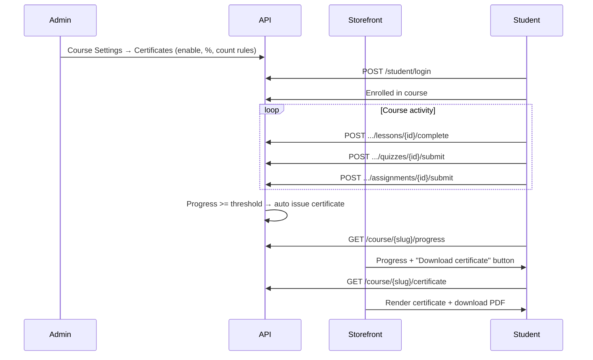

# Certificate — Storefront API Guide

**API base:** `https://<api-host>/v1`  
**Admin dashboard:** `https://<dashboard-host>/courses/{id}/update?tab=Settings` → **Certificates** tab

Student course complete korle (admin je **completion %** set kore) certificate **auto generate** hoy. Storefront theke student tar certificate **dekhte** ar **download** korte parbe — API certificate **data + design metadata** dey; PDF/image render **storefront app** e korte hobe.

---

## Quick reference — student endpoints

| Method | Path | Headers | Use case |
|--------|------|---------|----------|
| `GET` | `/student/certificates` | `app-key` + `Bearer` | My account — sob certificate list |
| `GET` | `/student/certificates/{id}` | `app-key` + `Bearer` | Ekta certificate detail |
| `GET` | `/course/{slug}/certificate` | `app-key` + `Bearer` | Course page theke oi course er certificate |
| `GET` | `/course/{slug}/progress` | `app-key` + `Bearer` | Progress bar / “certificate locked” UI |
| `POST` | `/course/{slug}/lessons/{lessonId}/complete` | `app-key` + `Bearer` | Lesson complete mark (progress + cert trigger) |

**Student auth:** `Authorization: Bearer <student_jwt>` from `POST /v1/student/login`  
**Tenant:** `app-key: <tenant_app_key>` (sob student route e)

> **Note:** API theke ready-made PDF URL **dey na**. Response e template path, student name, course title, signatures URL, etc. thake — storefront HTML/CSS overlay kore **view** ar client-side **PDF/PNG download** implement korbe.

---

## End-to-end flow



---

## Part 1 — Certificate kivabe issue hoy (auto)

Admin **Courses → Edit → Settings → Certificates** tab e configure kore:

| Admin field | API / DB | Meaning |
|-------------|----------|---------|
| Enable certificate | `is_enabled` | Off thakle kono certificate issue hoy na |
| Minimum completion (%) | `completion_percent` | e.g. `80` = 80% complete hole certificate |
| Count toward progress | `count_lessons`, `count_quizzes`, `count_assignments` | Kon item progress e dhukbe (course-wise customize) |
| Template / title / subtitles | `template_path`, `title`, `subtitle_one`, `subtitle_two` | Certificate design content |
| Signatures | `owner_signature`, `instructor_signature` | CDN image URLs (upload from admin) |

**Progress formula** (admin je item select kore):

```
progress_percent = (completed selected items) / (total selected items) × 100
```

| Item type | “Completed” mane |
|-----------|------------------|
| Lessons | `POST .../lessons/{lessonId}/complete` call hoyeche (published lesson) |
| Quizzes | Student oi quiz submit koreche |
| Assignments | Student oi assignment submit koreche |

**Auto-issue trigger:** Progress threshold cross korar por **prothom bar** certificate create hoy — quiz submit, assignment submit, ba lesson complete er por background e check hoy. Duplicate certificate hoy na (ek student + ek course = ek certificate).

---

## Part 2 — Progress (certificate er age UI)

Course page e progress bar ba “আর X% বাকি” দেখাতে:

```http
GET /v1/course/{course-slug}/progress
app-key: <tenant_app_key>
Authorization: Bearer <student_token>
```

**Success `200`:**

```json
{
  "data": {
    "lessons_completed": 4,
    "lessons_total": 5,
    "quizzes_completed": 2,
    "quizzes_total": 2,
    "assignments_completed": 1,
    "assignments_total": 1,
    "progress_percent": 87.5,
    "count_lessons": true,
    "count_quizzes": true,
    "count_assignments": true,
    "completed_lesson_ids": [12, 13, 14, 15]
  }
}
```

**Storefront UI hints:**

| Field | Use |
|-------|-----|
| `progress_percent` | Progress bar |
| `count_lessons` / `count_quizzes` / `count_assignments` | Kon metric UI te dekhano hobe |
| `completed_lesson_ids` | Lesson list e tick/check mark |

**Errors:**

| HTTP | Reason |
|------|--------|
| `400` | `enrollment required` — course e enroll nai |
| `404` | Course slug invalid |

### Lesson complete (progress update)

Video/text lesson shesh hole:

```http
POST /v1/course/{course-slug}/lessons/{lessonId}/complete
app-key: <tenant_app_key>
Authorization: Bearer <student_token>
```

**Success `200`:**

```json
{
  "message": "Lesson marked complete",
  "data": {
    "lessons_completed": 5,
    "lessons_total": 5,
    "progress_percent": 100,
    "completed_lesson_ids": [12, 13, 14, 15, 16]
  }
}
```

Idempotent — same lesson abar call korle error na, updated progress return kore. Threshold cross korle certificate auto issue hote pare.

---

## Part 3 — Certificate dekha (list + detail)

### 3.1 Sob certificate (My Account / Certificates page)

```http
GET /v1/student/certificates
app-key: <tenant_app_key>
Authorization: Bearer <student_token>
```

**Success `200`:**

```json
{
  "data": [
    {
      "id": 7,
      "course_id": 42,
      "course_title": "Complete Web Development",
      "certificate_number": "CERT-CLXY123ABC",
      "student_name": "Rahim Ahmed",
      "progress_percent": 100,
      "template_path": "/images/Certificat-14.jpg",
      "title": "Certificate of Completion",
      "subtitle_one": "This is to certify that",
      "subtitle_two": "has successfully completed the course",
      "owner_signature": "https://cdn.example.com/signatures/owner.png",
      "instructor_signature": "https://cdn.example.com/signatures/instructor.png",
      "issued_at": "2026-07-05T10:30:00Z"
    }
  ]
}
```

Empty list = `{"data": []}` — ekhono kono certificate issue hoyni.

**UI:** Card grid — course title, issue date, “View / Download” button → detail page.

### 3.2 Ekta certificate (by ID)

```http
GET /v1/student/certificates/{certificateId}
app-key: <tenant_app_key>
Authorization: Bearer <student_token>
```

Same `data` object as list item. Shudhu **oi student er** certificate; onno student er ID dile `404`.

### 3.3 Course page theke (by course slug)

Course complete hole course page e direct button:

```http
GET /v1/course/{course-slug}/certificate
app-key: <tenant_app_key>
Authorization: Bearer <student_token>
```

**Success `200`:** same certificate object as above.

**`404`:** Certificate ekhono issue hoyni (progress threshold পায়নি ba certificate disabled).

**Recommended UX:**

1. `GET /course/{slug}/progress` → percent dekhao
2. `progress_percent >= admin threshold` (storefront e progress theke bujho) **ba** certificate button enable
3. Button click → `GET /course/{slug}/certificate` → render modal/page

---

## Part 4 — Certificate response fields

| Field | Type | Storefront use |
|-------|------|----------------|
| `id` | number | Detail route, cache key |
| `course_id` | number | Course link back |
| `course_title` | string | Certificate body text |
| `certificate_number` | string | Unique ID — footer e “Certificate No: CERT-…” |
| `student_name` | string | Main recipient name (large text) |
| `progress_percent` | number | Optional badge (“Completed 100%”) |
| `template_path` | string | Background image path (see below) |
| `title` | string \| null | Top heading (e.g. “Certificate of Completion”) |
| `subtitle_one` | string \| null | Line above name |
| `subtitle_two` | string \| null | Line below name |
| `owner_signature` | string \| null | Full CDN URL — `` |
| `instructor_signature` | string \| null | Full CDN URL — `` |
| `issued_at` | ISO datetime | “Issued on …” |

### Template images (`template_path`)

Admin dashboard e preset designs:

| `template_path` | Asset |
|-----------------|-------|
| `/images/Certificat-14.jpg` | Design 1 |
| `/images/Certificat-15.jpg` | Design 2 |
| `/images/Certificat-16.jpg` | Design 3 |
| `/images/Certificat-17.jpg` | Design 4 |

Storefront e same files **`public/images/`** e copy rakho (dashboard er `frontend/public/images/` theke), ba `template_path` ke storefront origin diye resolve koro:

```
https://<storefront-host>/images/Certificat-14.jpg
```

Signatures (`owner_signature`, `instructor_signature`) already **full HTTPS CDN URL** — direct use koro.

---

## Part 5 — Storefront: View + Download implement

API PDF generate kore na. Storefront e typically:

### 5.1 View (on-screen)

1. Certificate API theke `data` load koro
2. Fixed aspect-ratio container (e.g. A4 landscape)
3. Background: `template_path` image
4. Absolute-positioned text overlay:
   - `title` — top center
   - `subtitle_one` — above name
   - `student_name` — center, bold, large
   - `subtitle_two` + `course_title` — below name
   - `certificate_number` + formatted `issued_at` — bottom
   - Signature images — bottom left/right

Example structure (concept):

```html
<div class="certificate" style="background-image: url('/images/Certificat-14.jpg')">
  <h1>{{ title }}</h1>
  <p>{{ subtitle_one }}</p>
  <h2>{{ student_name }}</h2>
  <p>{{ subtitle_two }} <strong>{{ course_title }}</strong></p>
  <p>Certificate No: {{ certificate_number }}</p>
  <p>Issued: {{ issued_at }}</p>
  
  
</div>
```

### 5.2 Download

| Approach | Pros |
|----------|------|
| **Browser Print → Save as PDF** | No extra library; `window.print()` + `@media print` CSS |
| **html2canvas + jsPDF** | Pixel-perfect PNG/PDF from DOM |
| **@react-pdf/renderer** | Programmatic PDF (template recreate) |

**Print approach (simplest):**

```javascript
function downloadCertificate() {
  window.print(); // user chooses "Save as PDF"
}
```

Print CSS e background image include koro:

```css
@media print {
  .certificate {
    -webkit-print-color-adjust: exact;
    print-color-adjust: exact;
  }
}
```

**Programmatic PDF (html2canvas + jsPDF example sketch):**

```javascript
import html2canvas from "html2canvas";
import { jsPDF } from "jspdf";

async function downloadAsPdf(element) {
  const canvas = await html2canvas(element, { scale: 2, useCORS: true });
  const img = canvas.toDataURL("image/png");
  const pdf = new jsPDF("landscape", "mm", "a4");
  pdf.addImage(img, "PNG", 0, 0, 297, 210);
  pdf.save(`certificate-${certificateNumber}.pdf`);
}
```

> CDN signature images cross-origin hole `html2canvas` e `useCORS: true` + image server e CORS header lagte pare.

---

## Part 6 — Suggested storefront routes (app-level)

| Route | API calls |
|-------|-----------|
| `/account/certificates` | `GET /student/certificates` |
| `/account/certificates/{id}` | `GET /student/certificates/{id}` |
| `/courses/{slug}` | `GET /course/{slug}/progress` + conditional `GET /course/{slug}/certificate` |

**Course page button logic:**

```
if GET /course/{slug}/certificate → 200:
  show "Download Certificate"
else:
  show progress from GET /course/{slug}/progress
  show "Complete X% more to unlock"
```

---

## Part 7 — Errors & auth

| HTTP | Typical cause |
|------|----------------|
| `401` | Missing/expired student token — login page e redirect |
| `403` | Invalid token |
| `404` | Certificate not found / not issued yet / wrong ID |
| `400` | Not enrolled (`enrollment required`) |

**Auth guard (storefront):**

```javascript
// Never send "Bearer undefined"
const token = session?.accessToken;
if (!token) {
  redirectToLogin();
  return;
}
headers: {
  "app-key": APP_KEY,
  Authorization: `Bearer ${token}`,
}
```

---

## Part 8 — Admin checklist (reference)

Storefront integrate korar age admin side confirm koro:

1. Course **Settings → Certificates** → **Enable certificate** ✓
2. **Minimum completion %** set (e.g. 100)
3. **Count toward progress** — lessons / quizzes / assignments tick
4. Template + title + signatures save
5. Course e published lessons/quizzes/assignments ache (progress 0/0 hole certificate issue hobe na)

---

## Related docs

- Quiz submit (progress): [QUIZ_STOREFRONT_API.md](./QUIZ_STOREFRONT_API.md)
- Assignment submit (progress): [ASSIGNMENT_STOREFRONT_API.md](./ASSIGNMENT_STOREFRONT_API.md)
- Student login: [STUDENT_PASSWORD_RESET_STOREFRONT_API.md](./STUDENT_PASSWORD_RESET_STOREFRONT_API.md) (login section)
