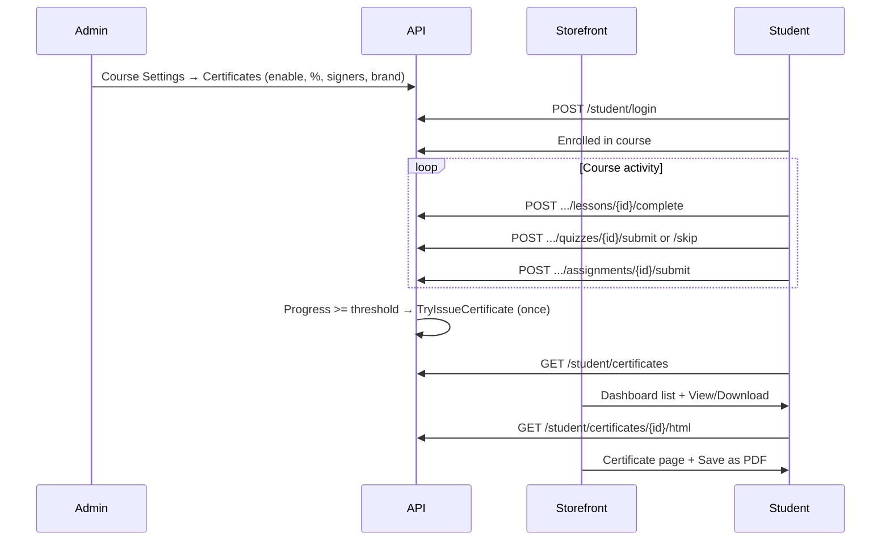

# Certificate — Storefront API Guide

**API base:** `https://<api-host>/v1`  
**Last updated:** July 2026  
**Storefront implement করতে (copy-paste code):** [CERTIFICATE_STOREFRONT_IMPLEMENTATION.md](./CERTIFICATE_STOREFRONT_IMPLEMENTATION.md)

Student course complete korle (admin je **completion %** set kore) certificate **auto generate** hoy. Storefront theke student tar certificate **dekhte** ar **download** korte parbe.

---

## Status

| Layer | Status |
|-------|--------|
| Auto-issue on progress threshold | ✅ Ready |
| Student list / detail / course lookup (JSON) | ✅ Ready |
| Server-rendered HTML view (`/html`) + print button | ✅ Ready |
| `download_url` in JSON responses | ✅ Ready |
| Storefront student dashboard UI | আপনার storefront এ implement করতে হবে |

> `GET /student/details` e certificate list **nai** — alada kore `GET /student/certificates` call korte hobe.

---

## Quick reference — student endpoints

| Method | Path | Headers | Use case |
|--------|------|---------|----------|
| `GET` | `/student/certificates` | `app-key` + `Bearer` | Dashboard — sob certificate list |
| `GET` | `/student/certificates/{id}` | `app-key` + `Bearer` | Ekta certificate detail (JSON) |
| `GET` | `/student/certificates/{id}/html` | `app-key` + `Bearer` | Rendered HTML + **Download PDF** button |
| `GET` | `/course/{slug}/certificate` | `app-key` + `Bearer` | Course page theke oi course er certificate (JSON) |
| `GET` | `/course/{slug}/progress` | `app-key` + `Bearer` | Progress bar / “certificate locked” UI |
| `POST` | `/course/{slug}/lessons/{lessonId}/complete` | `app-key` + `Bearer` | Lesson complete (cert trigger) |
| `POST` | `/course/{slug}/quizzes/{quizId}/submit` | `app-key` + `Bearer` | Quiz submit (cert trigger) |
| `POST` | `/course/{slug}/quizzes/{quizId}/skip` | `app-key` + `Bearer` | Quiz skip/forfeit (cert trigger) |
| `POST` | `/course/{slug}/assignments/{assignmentId}/submit` | `app-key` + `Bearer` | Assignment submit (cert trigger) |

**Student auth:** `Authorization: Bearer <student_jwt>` from `POST /v1/student/login`  
**Tenant:** `app-key: <tenant_app_key>` (sob student route e)

> **View + Download:** JSON e `download_url` thake (`…/student/certificates/{id}/html`), kintu browser e direct `window.open(download_url)` **kaj korbe na** — Bearer header jay na. Storefront e authenticated `fetch` → blob / `iframe srcdoc` use korben.

---

## End-to-end flow



---

## Part 1 — Certificate kivabe issue hoy (auto)

Admin **Courses → Edit → Settings → Certificates** tab e configure kore:

| Admin field | API / DB | Meaning |
|-------------|----------|---------|
| Enable certificate | `is_enabled` | Off thakle kono certificate issue hoy na |
| Minimum completion (%) | `completion_percent` | e.g. `80` = 80% complete hole certificate (default `100`) |
| Count toward progress | `count_lessons`, `count_quizzes`, `count_assignments` | Kon item progress e dhukbe |
| Template | `template_path` | Default: `/templates/minar-academy` |
| Title / subtitles | `title`, `subtitle_one`, `subtitle_two` | Certificate text |
| Brand / watermark | `brand_logo`, `watermark_image`, `watermark_opacity` (0–100) | CDN image URLs |
| Organization | `organization_name` | “offered by …” line |
| Primary signer | `signer_name`, `signer_role`, `signer_org` | Signature block text |
| Dual signers | `dual_signers_enabled`, `signer2_name`, `signer2_role`, `signer2_org` | Second signature block |
| Signature images | `owner_signature`, `instructor_signature` | CDN URLs (admin upload) |

**Progress formula:**

```
progress_percent = (completed selected items) / (total selected items) × 100
```

| Item type | “Completed” mane |
|-----------|------------------|
| Lessons | `POST .../lessons/{lessonId}/complete` |
| Quizzes | Student oi quiz **submit**, **skip**, ba time-limit **forfeit** koreche |
| Assignments | Student oi assignment submit koreche |

**Auto-issue trigger:** Threshold cross korar por **prothom bar** `TryIssueCertificate` certificate create kore. Duplicate hoy na — ek student + ek course = **ek** certificate. Issue hole abar call korle existing certificate return hoy (new create na).

**Certificate number:** 14-character lowercase hex string (e.g. `a1b2c3d4e5f607`) — `CERT-` prefix **nai**.

**Template note:** Admin save korle legacy `/images/Certificat-*.jpg` path gulo automatically `/templates/minar-academy` e normalize hoy. Notun course gulo Minar Academy template use kore.

---

## Part 2 — Progress (certificate er age UI)

```http
GET /v1/course/{course-slug}/progress
app-key: <tenant_app_key>
Authorization: Bearer <student_token>
```

**Success `200`:**

```json
{
  "data": {
    "lessons_completed": 4,
    "lessons_total": 5,
    "quizzes_completed": 2,
    "quizzes_total": 2,
    "assignments_completed": 1,
    "assignments_total": 1,
    "progress_percent": 87.5,
    "count_lessons": true,
    "count_quizzes": true,
    "count_assignments": true,
    "completed_lesson_ids": [12, 13, 14, 15],
    "completed_quiz_ids": [9, 11]
  }
}
```

> `completion_percent` threshold **ei response e nai**. Certificate ready kina check: `GET /course/{slug}/certificate` → `200` vs `404`.

**Lesson complete:**

```http
POST /v1/course/{course-slug}/lessons/{lessonId}/complete
```

**Success `200`:**

```json
{
  "message": "Lesson marked complete",
  "data": { "...same progress breakdown..." }
}
```

Idempotent — same lesson abar call korle error na.

**Errors:**

| HTTP | Reason |
|------|--------|
| `400` | `enrollment required` |
| `404` | Course slug invalid / lesson not found |

---

## Part 3 — Certificate dekha (list + detail)

### 3.1 Sob certificate (dashboard list)

```http
GET /v1/student/certificates
app-key: <tenant_app_key>
Authorization: Bearer <student_token>
```

**Success `200`:**

```json
{
  "data": [
    {
      "id": 7,
      "course_id": 42,
      "course_title": "Complete Web Development",
      "certificate_number": "a1b2c3d4e5f607",
      "student_name": "Rahim Ahmed",
      "progress_percent": 100,
      "template_path": "/templates/minar-academy",
      "title": "Certificate of Completion",
      "subtitle_one": "has successfully completed",
      "subtitle_two": null,
      "brand_logo": "https://cdn.example.com/logo.png",
      "watermark_image": "https://cdn.example.com/watermark.png",
      "watermark_opacity": 30,
      "organization_name": "Minar Academy",
      "signer_name": "Dr. Karim",
      "signer_role": "Director",
      "signer_org": "Minar Academy",
      "dual_signers_enabled": true,
      "signer2_name": "Fatima Begum",
      "signer2_role": "Lead Instructor",
      "signer2_org": "Minar Academy",
      "pricing_model": "free",
      "owner_signature": "https://cdn.example.com/sig-owner.png",
      "instructor_signature": "https://cdn.example.com/sig-instructor.png",
      "issued_at": "2026-07-05T10:30:00Z",
      "download_url": "https://api.example.com/v1/student/certificates/7/html"
    }
  ]
}
```

Empty list = `{"data": []}`

### 3.2 Ekta certificate (by ID, JSON)

```http
GET /v1/student/certificates/{certificateId}
```

Same `data` object as list item. Onno student er ID dile `404` (`Certificate not found`).

### 3.3 Rendered HTML (view + download) — recommended

```http
GET /v1/student/certificates/{certificateId}/html
app-key: <tenant_app_key>
Authorization: Bearer <student_token>
```

**Success `200`:** `Content-Type: text/html; charset=utf-8`

- Minar Academy design (admin preview-এর মতো)
- Top-right **Download PDF** button → `window.print()` → browser “Save as PDF”
- `issued_at` display format: `YYYY-MM-DD HH:mm:ss` (local server time)

**Errors:**

| HTTP | Reason |
|------|--------|
| `404` | Certificate not found / wrong student |
| `400` | `unsupported certificate template: …` (non-Minar legacy path — rare after admin re-save) |

> Course slug theke HTML **alada endpoint nai**. `GET /course/{slug}/certificate` → JSON → `id` diye `/student/certificates/{id}/html` fetch korben.

### 3.4 Course page theke (by slug, JSON)

```http
GET /v1/course/{course-slug}/certificate
```

**Success `200`:** same certificate JSON (`download_url` included).  
**`404`:** Certificate ekhono issue hoyni ba disabled.

---

## Part 4 — Response fields

| Field | Type | Storefront use |
|-------|------|----------------|
| `id` | number | Detail route, HTML fetch |
| `course_id` | number | Course link back |
| `course_title` | string | List card title |
| `certificate_number` | string | Unique 14-char hex ID |
| `student_name` | string | Recipient name |
| `progress_percent` | number | Progress at issue time |
| `template_path` | string | Usually `/templates/minar-academy` |
| `title` | string \| null | Certificate heading |
| `subtitle_one` | string \| null | Completion line (e.g. “has successfully completed”) |
| `subtitle_two` | string \| null | Legacy templates only |
| `brand_logo` | string \| null | Full CDN URL |
| `watermark_image` | string \| null | Full CDN URL |
| `watermark_opacity` | number | 0–100 (default 30) |
| `organization_name` | string \| null | Organization in subline |
| `signer_name` / `signer_role` / `signer_org` | string \| null | Primary signer text |
| `dual_signers_enabled` | boolean | Two signature blocks |
| `signer2_name` / `signer2_role` / `signer2_org` | string \| null | Secondary signer text |
| `pricing_model` | `"free"` \| `"paid"` | “a FREE/PAID online course…” subline |
| `owner_signature` | string \| null | Full CDN URL |
| `instructor_signature` | string \| null | Full CDN URL |
| `issued_at` | ISO datetime | Issue timestamp |
| `download_url` | string | `{scheme}://{host}/v1/student/certificates/{id}/html` |

### Signature image mapping (render logic)

| Mode | Primary image | Secondary image |
|------|---------------|-----------------|
| Single signer (`dual_signers_enabled: false`) | `instructor_signature`, else `owner_signature` | — |
| Dual signers (`dual_signers_enabled: true`) | `instructor_signature` | `owner_signature` |

### Templates

| `template_path` | `/html` endpoint | Client render |
|-----------------|------------------|---------------|
| `/templates/minar-academy` (default) | ✅ Supported | Optional (Approach C) |
| Empty string | ✅ Treated as Minar | — |
| `/images/Certificat-14.jpg` … `17.jpg` | ✅ Treated as Minar in renderer | Legacy overlay possible |
| Other custom path | ❌ `400` unsupported | Client-side only |

---

## Part 5 — Suggested storefront routes

| Route | API calls |
|-------|-----------|
| `/dashboard/certificates` | `GET /student/certificates` |
| `/dashboard/certificates/{id}` | `GET /student/certificates/{id}` + `/html` embed or new tab |
| `/courses/{slug}` | `GET /course/{slug}/progress` + `GET /course/{slug}/certificate` |

**Course page button:**

```
GET /course/{slug}/certificate → 200  → "View Certificate"
GET /course/{slug}/certificate → 404  → progress bar + locked message
```

---

## Part 6 — Errors & auth

| HTTP | Typical cause |
|------|----------------|
| `401` | Missing/expired student token |
| `403` | Invalid token |
| `404` | Certificate not found / not issued yet / course not found |
| `400` | `enrollment required`; invalid certificate ID; unsupported template (HTML) |
| `500` | Server error |

```javascript
const token = session?.accessToken;
if (!token) {
  redirectToLogin();
  return;
}
headers: {
  "app-key": APP_KEY,
  Authorization: `Bearer ${token}`,
}
```

**কখনো করবেন না:** `Authorization: Bearer ${token}` jokhon `token` undefined — `Bearer undefined` পাঠালে 401।

---

## Part 7 — 404 / empty list troubleshooting

| Symptom | Check |
|---------|-------|
| List empty but course “complete” | Admin: certificate **enabled**? Threshold met? Published lessons/quizzes exist? |
| `404` on `/course/{slug}/certificate` | Progress `progress_percent` < admin `completion_percent`, or cert disabled |
| `401` on all calls | Student token expired; re-login |
| HTML `400` unsupported template | Admin course re-save (migrates to Minar) or use client render |
| Wrong tenant data | `app-key` matches student’s tenant |
| Progress stuck at 0% | No published content, or count flags exclude completed item types |

---

## Related docs

- **Implementation (copy-paste):** [CERTIFICATE_STOREFRONT_IMPLEMENTATION.md](./CERTIFICATE_STOREFRONT_IMPLEMENTATION.md)
- Quiz submit/skip: [QUIZ_STOREFRONT_API.md](./QUIZ_STOREFRONT_API.md)
- Assignment submit: [ASSIGNMENT_STOREFRONT_API.md](./ASSIGNMENT_STOREFRONT_API.md)
- Lesson progress: [LESSON_VIDEO_PROGRESS_STOREFRONT_API.md](./LESSON_VIDEO_PROGRESS_STOREFRONT_API.md)
- Student login: [STUDENT_DEVICE_LOGIN_STOREFRONT_API.md](./STUDENT_DEVICE_LOGIN_STOREFRONT_API.md)
