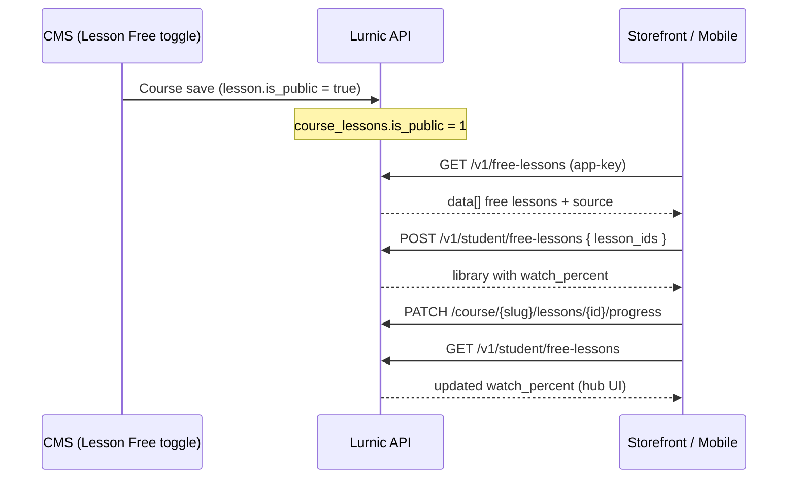

# Free Lessons (Free Class) — Storefront API

**API base:** `https://<api-host>/v1`  
**CMS field:** Lesson → **Free** toggle (`is_public = true`)  
**Related:** [LESSON_VIDEO_PROGRESS_STOREFRONT_API.md](./LESSON_VIDEO_PROGRESS_STOREFRONT_API.md) · [STUDENT_CLASS_PROFILE_STOREFRONT_API.md](./STUDENT_CLASS_PROFILE_STOREFRONT_API.md)

Admin CMS-এ কোনো lesson-এ **Free** চালু করলে সেই lesson Free Class / ফ্রি লেসন catalog-এ আসে। Enrollment লাগে না play করতে। Student library server-এ sync হয় (device-local AsyncStorage নয়)।

---

## Quick reference

| Method | Path | Auth | Use case |
|--------|------|------|----------|
| `GET` | `/free-lessons` | `app-key` only | Catalog — সব free/public lesson (N+1 নেই) |
| `GET` | `/student/free-lessons` | `app-key` + Bearer | আমার free library + `watch_percent` |
| `POST` | `/student/free-lessons` | `app-key` + Bearer | Library-তে add (max 3 / request) |
| `DELETE` | `/student/free-lessons/{lessonId}` | `app-key` + Bearer | Library থেকে remove |
| `PATCH` | `/course/{slug}/lessons/{id}/progress` | Bearer | Watch % save (public lesson-এ enrollment ছাড়াই) |
| `POST` | `/course/{slug}/lessons/{id}/complete` | Bearer | Complete mark |

---

## CMS → Storefront sync (কীভাবে কাজ করে)



**Admin steps**

1. Course → Curriculum → Lesson edit  
2. **Free** toggle ON + **Publish** ON  
3. Course save  

**Storefront rules**

- Catalog দেখা যায় login ছাড়া (`app-key` থাকলেই)  
- Library save করতে student login লাগে  
- `pricing_model = free` লাগে না — শুধু `is_public`  

---

## 1. Catalog — `GET /v1/free-lessons`

```http
GET /v1/free-lessons?class_slug=class-8&limit=50&offset=0
app-key: <tenant_app_key>
```

| Query | Type | Notes |
|-------|------|--------|
| `class_slug` | string? | Course category **বা** subcategory slug দিয়ে filter |
| `limit` | number? | Default `50`, max `100` |
| `offset` | number? | Pagination |

**Inclusion**

- `course_lessons.is_public = true`
- `course_lessons.is_published = true`
- Parent chapter `access = published`
- Parent course `visibility = public`

**Success `200`**

```json
{
  "data": [
    {
      "lesson_id": 16,
      "lesson_title": "প্রথম পাঠ",
      "chapter_id": 3,
      "chapter_title": "প্রথম খন্ড (১ম অধ্যায়)",
      "course_id": 3,
      "course_slug": "-3",
      "course_title": "এসো আরবি শিখি",
      "featured_image": "https://…",
      "lesson_type": "video",
      "source_type": "youtube",
      "source": { "data": { "data": "https://…", "is_file": false } },
      "is_public": true,
      "class_slugs": ["class-8"]
    }
  ],
  "meta": { "total": 4, "limit": 50, "offset": 0 }
}
```

`class_slugs` = parent course-এর subcategory/category slug (lesson-level map এখনো নেই)।

---

## 2. My library — `GET /v1/student/free-lessons`

```http
GET /v1/student/free-lessons
app-key: <tenant_app_key>
Authorization: Bearer <student_jwt>
```

**Success `200`**

```json
{
  "data": [
    {
      "lesson_id": 16,
      "lesson_title": "প্রথম পাঠ",
      "chapter_title": "প্রথম খন্ড (১ম অধ্যায়)",
      "course_id": 3,
      "course_slug": "-3",
      "course_title": "এসো আরবি শিখি",
      "featured_image": "https://…",
      "source_type": "youtube",
      "source": { "data": { "data": "https://…", "is_file": false } },
      "added_at": "2026-09-04T07:00:00Z",
      "watch_percent": 40,
      "watch_seconds": 288,
      "duration_seconds": 720,
      "completed": false
    }
  ]
}
```

Hub UI: `watch_percent > 0` → `৪০% দেখা হয়েছে`; না হলে `এখনো দেখা হয়নি`।

---

## 3. Add — `POST /v1/student/free-lessons`

```http
POST /v1/student/free-lessons
app-key: <tenant_app_key>
Authorization: Bearer <student_jwt>
Content-Type: application/json

{ "lesson_ids": [16, 17] }
```

| Rule | Value |
|------|--------|
| Max per request | `3` |
| Max total library | `20` |
| Idempotent | একই id আবার দিলে OK |
| Invalid / not free | `422` |

**Success `200`**

```json
{
  "data": [ /* full library, same shape as GET */ ],
  "message": "Free lessons saved"
}
```

---

## 4. Remove — `DELETE /v1/student/free-lessons/{lessonId}`

```http
DELETE /v1/student/free-lessons/16
app-key: <tenant_app_key>
Authorization: Bearer <student_jwt>
```

**Success `200`:** `{ "message": "Free lesson removed" }`  
**404:** library-তে না থাকলে

---

## 5. Playback & progress

Public/free lesson playable without enrollment (client lock: `!enrolled && !is_public`).

| Need | Call |
|------|------|
| Full course / source | `GET /v1/course/{slug}` |
| Save watch position | `PATCH /v1/course/{slug}/lessons/{id}/progress` |
| Mark done | `POST /v1/course/{slug}/lessons/{id}/complete` |

**Important:** Progress endpoints এখন **public lesson**-এ enrollment ছাড়াও কাজ করে (logged-in student)।

Progress body (existing):

```json
{
  "max_position_seconds": 288,
  "duration_seconds": 720
}
```

---

## 6. Mobile wiring (`freeLessons.ts`)

| Before | After |
|--------|--------|
| N+1 `GET /course` + `GET /course/{slug}` | `GET /free-lessons` |
| AsyncStorage `getMyFreeLessons` / `mergeMyFreeLessons` | `GET` / `POST` `/student/free-lessons` |
| Local watch label | `watch_percent` from library GET |

Screens: FreeLessons hub → FreeLessonSelect (max 3) → FreeLessonAdded → player

---

## 7. DB

Migration: `00066_create_student_free_lessons_table.sql`

```text
student_free_lessons
  tenant_id, student_id, lesson_id, course_id, added_at
  UNIQUE (tenant_id, student_id, lesson_id)
```

Eligibility flag: existing `course_lessons.is_public` (CMS label: **Free**).

---

## 8. Acceptance checklist

- [ ] CMS Lesson → Free ON → `GET /free-lessons`-এ আসে (playable `source` সহ)
- [ ] `class_slug` filter কাজ করে (category/subcategory slug)
- [ ] `POST` >3 ids বা non-public id → `422`
- [ ] একই student অন্য device-এ library দেখে
- [ ] Hub-এ accurate `watch_percent`
- [ ] Catalog unauthenticated; save requires login
- [ ] Major course/grade-এ ≥1 Free preview mark করা

---

## Curl smoke test

```bash
# Catalog (no login)
curl -s -H "app-key: $APP_KEY" "$API/v1/free-lessons" | jq .

# Add to library
curl -s -X POST -H "app-key: $APP_KEY" -H "Authorization: Bearer $TOKEN" \
  -H "Content-Type: application/json" \
  -d '{"lesson_ids":[16]}' \
  "$API/v1/student/free-lessons" | jq .

# Library + watch %
curl -s -H "app-key: $APP_KEY" -H "Authorization: Bearer $TOKEN" \
  "$API/v1/student/free-lessons" | jq .
```
