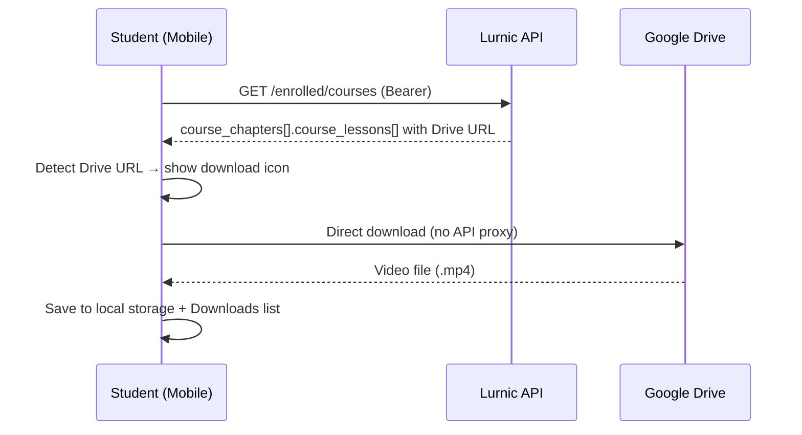

# Lesson Offline Download (Google Drive) — Backend Implementation Guide

**API base:** `https://<api-host>/v1`  
**Backend repo:** `lurnic-server/api` (Go + Gin + MySQL)  
**Mobile client:** `mobile/src/lib/offlineDownloads.ts`  
**Web client:** offline download নেই (শুধু mobile)

---

## Table of contents

1. [Overview](#1-overview)
2. [Current architecture](#2-current-architecture)
3. [Backend responsibilities](#3-backend-responsibilities)
4. [Lesson data contract](#4-lesson-data-contract)
5. [Admin panel requirements](#5-admin-panel-requirements)
6. [Storefront API endpoints](#6-storefront-api-endpoints)
7. [Optional: `google_drive` source type](#7-optional-google_drive-source-type)
8. [Optional: proxy download endpoint](#8-optional-proxy-download-endpoint)
9. [Authorization & enrollment rules](#9-authorization--enrollment-rules)
10. [Google Drive file requirements](#10-google-drive-file-requirements)
11. [QA checklist](#11-qa-checklist)
12. [Implementation status](#12-implementation-status)

---

## 1. Overview

Mobile app-এ enrolled student Google Drive video link থাকা lesson **offline save** করতে পারে।  
এটি **client-side feature** — mobile সরাসরি Google Drive থেকে file download করে device storage-এ রাখে।

**Backend-এ নতুন endpoint বাধ্যতামূলক নয়** (v1 implementation)।  
Backend-এর কাজ: lesson API response-এ Drive URL সঠিকভাবে return করা এবং enrolled student-কে সেই data access দেওয়া।

### User flow (mobile)



---

## 2. Current architecture

| Layer | Responsibility |
|-------|----------------|
| **Admin** | Lesson-এ Google Drive share link save (`source.data.data`) |
| **Backend** | Enrolled student-এর জন্য lesson object return (URL intact) |
| **Mobile** | Drive URL detect → download → local play |
| **Web** | Offline download support নেই |

### Mobile client — Drive URL detection order

`downloadUrlForLesson()` এই সোর্সগুলো থেকে URL খোঁজে (priority order):

1. `lesson.source.data.data` — primary video URL
2. `lesson.resources[]` — attachment `file_path` / `url`
3. `lesson.description` — HTML `<a href="...">` links
4. `lesson.description` + `source.data.data` — regex দিয়ে embedded Drive URLs

### Supported Drive URL formats (mobile regex)

```
https://drive.google.com/file/d/{FILE_ID}/view
https://drive.google.com/file/d/{FILE_ID}/edit
https://drive.google.com/open?id={FILE_ID}
https://drive.google.com/uc?export=download&id={FILE_ID}
https://docs.google.com/uc?export=download&id={FILE_ID}
https://drive.usercontent.google.com/download?id={FILE_ID}
```

### What is NOT downloadable (mobile rules)

| Source | Offline save |
|--------|--------------|
| YouTube (`source_type: youtube`) | ❌ |
| Vimeo (`source_type: vimeo`) | ❌ |
| Google Drive **video** link | ✅ |
| Google Drive **PDF** link | ❌ (material হিসেবে open হয়) |
| Direct `.mp4` / hosted upload URL | ✅ |
| `sound_cloud`, `spotify` | ❌ |

---

## 3. Backend responsibilities

### Must have (v1 — no new endpoint)

- [x] Lesson `source.data.data`-তে full Google Drive share URL store ও return করা
- [x] `GET /enrolled/courses` nested curriculum-এ lesson object complete return
- [x] `GET /course/{slug}` enrolled/unlocked lesson-এ Drive URL strip না করা
- [x] HTML `description` sanitize করলে Drive `<a href>` link রাখা (server-side sanitization নেই — description intact)
- [x] `resources[].file_path` বা `url` field populate করা (attachment হলে)

### Should have (recommended)

- [x] Admin validation: Drive URL format check on save (`source_type: google_drive`)
- [x] `source_type: "google_drive"` enum support (see §7)
- [x] Lesson response-এ `offline_downloadable: true` computed field
- [x] Lesson response-এ `download_url` computed field (Drive / direct `.mp4`)

### Nice to have (v2 — if direct Drive download fails often)

- [x] Proxy download endpoint (see §8)
- [ ] Server-side Drive file metadata fetch (`mimeType`, `fileSize`)

---

## 4. Lesson data contract

### Minimum lesson object (enrolled student view)

```json
{
  "id": 42,
  "title": "Chapter 1 — Introduction",
  "description": "<p>Class notes and reference.</p>",
  "lesson_type": "video",
  "source_type": "upload",
  "source": {
    "data": {
      "data": "https://drive.google.com/file/d/1AbCdEfGhIjKlMnOpQrStUvWxYz/view?usp=sharing",
      "is_file": false,
      "playback_times": "00:15:30"
    }
  },
  "resources": [],
  "is_published": true,
  "is_public": false,
  "position": 1,
  "chapter_id": 7,
  "offline_downloadable": true,
  "download_url": "https://drive.google.com/file/d/1AbCdEfGhIjKlMnOpQrStUvWxYz/view?usp=sharing"
}
```

### Recommended v2 fields (implemented)

```json
{
  "source_type": "google_drive",
  "source": {
    "data": {
      "data": "https://drive.google.com/file/d/1AbCdEfGhIjKlMnOpQrStUvWxYz/view",
      "is_file": false,
      "drive_file_id": "1AbCdEfGhIjKlMnOpQrStUvWxYz",
      "playback_times": "00:15:30"
    }
  },
  "offline_downloadable": true,
  "download_url": "https://drive.google.com/file/d/1AbCdEfGhIjKlMnOpQrStUvWxYz/view"
}
```

| Field | Type | Notes |
|-------|------|-------|
| `source.data.data` | `string` | **Required** — full share URL |
| `source.data.is_file` | `boolean` | `false` for Drive links |
| `source.data.drive_file_id` | `string` | Optional — extracted file ID (auto on admin save) |
| `source.data.playback_times` | `string` | Optional — `HH:MM:SS` or seconds |
| `offline_downloadable` | `boolean` | Computed by backend |
| `download_url` | `string` | Computed — explicit download source |

---

## 5. Admin panel requirements

### Lesson create/edit form

| Field | Rule |
|-------|------|
| `lesson_type` | Must be `video` for offline video save |
| `source_type` | `upload` (v1) or `google_drive` (v2) |
| Video URL input | Accept full Google Drive share link |
| Validation | Regex: `drive\.google\.com\/file\/d\/[a-zA-Z0-9_-]+` or `id=` param |

### Admin save logic (backend — implemented)

```
IF lesson_type == "video" AND source contains Drive URL:
  source_type = "google_drive"
  source.data.data = normalized share URL
  source.data.drive_file_id = extracted FILE_ID
  source.data.is_file = false
```

**Backend module:** `api/internal/modules/course/drive.go`

---

## 6. Storefront API endpoints

Backend-এ **নতুন endpoint ছাড়াই** কাজ করে যদি নিচের endpoint-গুলো সঠিক lesson data return করে।

### Primary endpoints

| Method | Path | Auth | Lesson data needed |
|--------|------|------|-------------------|
| `GET` | `/enrolled/courses` | Bearer | Full nested `course.course_chapters[].course_lessons[]` |
| `GET` | `/course/{slug}` | `app-key` (+ optional Bearer) | Full curriculum for enrolled preview |

**Backend module:** `modules/enrollment` → `course.LoadPublicCoursesByIDs()` (batch load)

---

## 7. `google_drive` source type

### Database migration

`migrations/00065_add_google_drive_lesson_source_type.sql`

### Backend helpers

| File | Purpose |
|------|---------|
| `internal/modules/course/drive.go` | `ExtractDriveFileID`, `OfflineDownloadable`, `NormalizeLessonSource` |
| `internal/modules/course/public_mapper.go` | Storefront lesson mapping with computed fields |
| `internal/models/course.go` | `GoogleDrive` enum + `Source.DriveFileID` |

---

## 8. Proxy download endpoint

**Implemented (v2 thin proxy).**

```
GET /v1/course/{slug}/lessons/{lessonId}/download
```

**Headers:**
```
Authorization: Bearer <student_jwt>
app-key: <tenant_key>
```

**Query params:**
| Param | Values | Default |
|-------|--------|---------|
| `format` | `json` | redirect (302) |

**Auth rules:**
1. Student must be enrolled in course
2. Lesson must belong to course and be published
3. Lesson must have downloadable source (Drive or hosted video)

**Response — default (302 redirect):**

```
HTTP/1.1 302 Found
Location: https://drive.usercontent.google.com/download?id={FILE_ID}&export=download&confirm=t
Content-Disposition: attachment; filename="chapter-1-intro.mp4"
```

**Response — `?format=json`:**

```json
{
  "data": {
    "download_url": "https://drive.usercontent.google.com/download?id=abc&export=download&confirm=t",
    "file_name": "chapter-1-intro.mp4",
    "content_type": "video/mp4"
  }
}
```

**Errors:**

| HTTP | error code | When |
|------|------------|------|
| `401` | `UNAUTHORIZED` | No/invalid JWT |
| `403` | `NOT_ENROLLED` | Student not enrolled |
| `404` | `LESSON_NOT_FOUND` | Invalid lesson/course |
| `422` | `NOT_DOWNLOADABLE` | YouTube/Vimeo/PDF lesson |

**Backend files:** `handler_download.go`, `download.go`, route in `router.go`

---

## 9. Authorization & enrollment rules

| Viewer | `source.data.data` (Drive URL) | Offline download (mobile) |
|--------|-------------------------------|---------------------------|
| Not logged in | Hidden for non-`is_public` lessons (client-side) | ❌ |
| Logged in, not enrolled | Hidden for locked lessons (client-side) | ❌ |
| Enrolled student | **Must return full URL** | ✅ |
| `is_public: true` preview lesson | Return URL | ✅ (if enrolled for save button) |

> **Note:** Backend currently returns full lesson source for all viewers on public endpoints. Mobile handles enrollment gating for the download button.

---

## 10. Google Drive file requirements

1. File type: **video** (`.mp4`, `.m4v`, `.webm`, `.mov`)
2. Share setting: **"Anyone with the link" → Viewer**
3. Link format: Full `drive.google.com/file/d/.../view` URL
4. PDF/note হলে `resources[]`-এ রাখুন, primary `source.data.data`-তে নয়

---

## 11. QA checklist

### Backend API tests

```bash
API_URL="https://api.minaracademy.com/v1"
TOKEN="<student_jwt>"
SLUG="hsc-physics"

# 1. Enrolled courses returns Drive URL
curl -s "$API_URL/enrolled/courses" \
  -H "Authorization: Bearer $TOKEN" \
  -H "app-key: $APP_KEY" \
  | jq '.data[].course.course_chapters[].course_lessons[] | select(.source.data.data | test("drive.google.com"))'

# 2. Course detail returns same URL for enrolled student
curl -s "$API_URL/course/$SLUG" \
  -H "Authorization: Bearer $TOKEN" \
  -H "app-key: $APP_KEY" \
  | jq '.data.course_chapters[].course_lessons[] | select(.offline_downloadable == true)'
```

### Expected results

- [x] Drive URL present in `source.data.data` for enrolled student
- [x] URL not stripped/truncated
- [x] `offline_downloadable` + `download_url` computed fields present
- [ ] Non-enrolled student source hiding (client-side today)
- [ ] Admin frontend: Drive URL validation (pending admin dashboard)

---

## 12. Implementation status

| Item | Status | Owner |
|------|--------|-------|
| Mobile offline download (Drive detect + save) | ✅ Done | `mobile/` |
| Mobile UI (download icon, Downloads screen) | ✅ Done | `mobile/` |
| Backend: return Drive URL in lesson response | ✅ Done | `lurnic-server/api` |
| Backend: `google_drive` source_type enum | ✅ Done | `lurnic-server/api` |
| Backend: `offline_downloadable` + `download_url` | ✅ Done | `lurnic-server/api` |
| Backend: Drive URL validation on admin save | ✅ Done | `lurnic-server/api` |
| Backend: proxy download endpoint | ✅ Done | `lurnic-server/api` |
| Admin: Drive URL validation (frontend) | ❌ Not started | Admin dashboard |
| Web offline download | ❌ Out of scope | — |

---

## Related docs

- Master API guide: [`docs/MINAR_ACADEMY_STOREFRONT_API.md`](./MINAR_ACADEMY_STOREFRONT_API.md) — §6.3 `/enrolled/courses` nested curriculum
- Video progress: [`docs/LESSON_VIDEO_PROGRESS_STOREFRONT_API.md`](./LESSON_VIDEO_PROGRESS_STOREFRONT_API.md)
