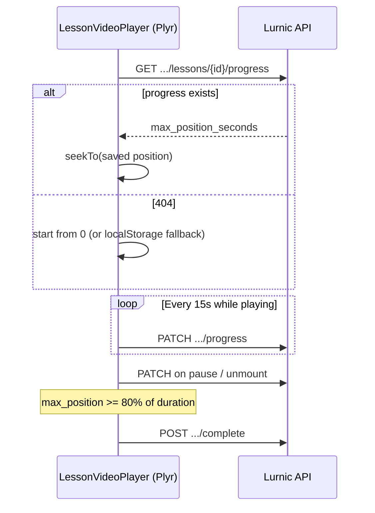

# Lesson Video Progress — Storefront API

**API base:** `https://<api-host>/v1`

YouTube/upload video lesson e student **koto second porjonto dekheche** (resume + analytics) save/load er jonno.  
Lesson **complete mark** (`POST .../complete`) alada endpoint — eta shudhu watch position track kore.

**Related docs:** [CERTIFICATE_STOREFRONT_API.md](./CERTIFICATE_STOREFRONT_API.md) (course progress + lesson complete)

---

## Quick reference

| Method | Path | Headers | Use case |
|--------|------|---------|----------|
| `GET` | `/course/{slug}/lessons/{lessonId}/progress` | `app-key` + `Bearer` | Resume — saved max position load |
| `PATCH` | `/course/{slug}/lessons/{lessonId}/progress` | `app-key` + `Bearer` | Heartbeat save (every ~15s while playing) |
| `GET` | `/course/{slug}/progress` | `app-key` + `Bearer` | Course-wide progress + `completed_lesson_ids` |
| `POST` | `/course/{slug}/lessons/{lessonId}/complete` | `app-key` + `Bearer` | Lesson complete (e.g. 80% threshold) |

**Student auth:** `Authorization: Bearer <student_jwt>` from `POST /v1/student/login`  
**Tenant:** `app-key: <tenant_app_key>`

---

## End-to-end flow (storefront player)



---

## GET saved watch progress

```http
GET /v1/course/{course-slug}/lessons/{lessonId}/progress
app-key: <tenant_app_key>
Authorization: Bearer <student_token>
```

**Success `200`:**

```json
{
  "data": {
    "lesson_id": 12,
    "max_position_seconds": 320.5,
    "duration_seconds": 720,
    "progress_percent": 44.5,
    "completed": false,
    "updated_at": "2026-07-05T12:34:56Z"
  }
}
```

| Field | Meaning |
|-------|---------|
| `max_position_seconds` | Highest playback timestamp reached (seek-forward safe) |
| `duration_seconds` | Last known total video length from player |
| `progress_percent` | Server-calculated from max position ÷ duration |
| `completed` | `true` if `POST .../complete` already recorded for this lesson |

**Errors:**

| HTTP | Reason |
|------|--------|
| `404` | `progress not found` — no saved row yet; start from 0 |
| `404` | `course not found` / `lesson not found` |
| `400` | `enrollment required` |
| `401` | Invalid/expired token |

---

## PATCH save watch progress

```http
PATCH /v1/course/{course-slug}/lessons/{lessonId}/progress
app-key: <tenant_app_key>
Authorization: Bearer <student_token>
Content-Type: application/json
```

**Body:**

```json
{
  "max_position_seconds": 320.5,
  "duration_seconds": 720,
  "progress_percent": 44.4
}
```

| Field | Required | Notes |
|-------|----------|-------|
| `max_position_seconds` | Yes | ≥ 0; server **never decreases** stored max on update |
| `duration_seconds` | No | ≥ 0; server keeps the higher of existing vs new |
| `progress_percent` | No | Ignored for persistence — server recalculates from max ÷ duration |

**Success `200`:**

```json
{
  "data": {
    "lesson_id": 12,
    "max_position_seconds": 320.5,
    "duration_seconds": 720,
    "progress_percent": 44.5,
    "completed": false,
    "updated_at": "2026-07-05T12:35:10Z"
  }
}
```

**Server rules:**

- `max_position_seconds` only increases (prevents seek-back from lowering progress)
- `progress_percent` capped at 100
- Idempotent — same or lower max position still returns `200` with stored values
- Does **not** auto-complete the lesson; call `POST .../complete` separately at your threshold (e.g. 80%)

**Errors:**

| HTTP | Reason |
|------|--------|
| `400` | Validation failed / `enrollment required` |
| `404` | `course not found` / `lesson not found` |

---

## Storefront integration (`lib/courseProgressApi.ts`)

Replace localStorage-only helpers when API is deployed:

```typescript
export async function loadWatchPosition(
  courseSlug: string,
  lessonId: number,
  token: string
): Promise<number> {
  const res = await axios.get(
    `${API_BASE}/course/${courseSlug}/lessons/${lessonId}/progress`,
    { headers: studentHeaders(token) }
  );
  return res.data.data.max_position_seconds ?? 0;
  // 404 → return 0
}

export async function saveWatchPosition(
  courseSlug: string,
  lessonId: number,
  maxPosition: number,
  duration: number,
  token: string
): Promise<void> {
  await axios.patch(
    `${API_BASE}/course/${courseSlug}/lessons/${lessonId}/progress`,
    {
      max_position_seconds: maxPosition,
      duration_seconds: duration,
    },
    { headers: studentHeaders(token) }
  );
}
```

**Migration tip:** On first successful PATCH after deploy, clear matching `localStorage` key `watch:{studentId}:{lessonId}`.

---

## Plyr player hints

Track **max position**, not raw `currentTime` on every tick:

```typescript
let maxPosition = 0;

player.on("timeupdate", () => {
  const t = player.currentTime;
  if (t > maxPosition) maxPosition = t;
});

player.on("ready", async () => {
  const saved = await loadWatchPosition(slug, lessonId, token);
  if (saved > 0) player.currentTime = saved;
});
```

Save on: 15s interval while playing, pause, ended, route change.

---

## Database

Table: `student_lesson_video_progress`  
Unique: `(tenant_id, student_id, lesson_id)` per lesson per student.

Migration: `api/migrations/00054_create_student_lesson_video_progress_table.sql`

Run migrations after deploy:

```bash
goose -dir api/migrations mysql "$GOOSE_DBSTRING" up
```

---

## Related endpoints (already live)

### Course progress (sidebar ticks)

```http
GET /v1/course/{course-slug}/progress
```

Returns `completed_lesson_ids` for lesson checkmarks.

### Lesson complete

```http
POST /v1/course/{course-slug}/lessons/{lessonId}/complete
```

Call when watch threshold reached (client-side, e.g. 80%). Idempotent.

See [CERTIFICATE_STOREFRONT_API.md](./CERTIFICATE_STOREFRONT_API.md) for full response shapes.
