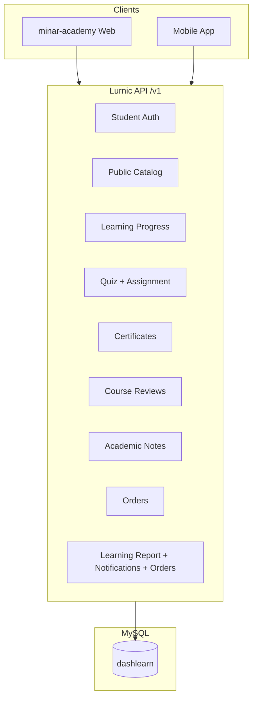
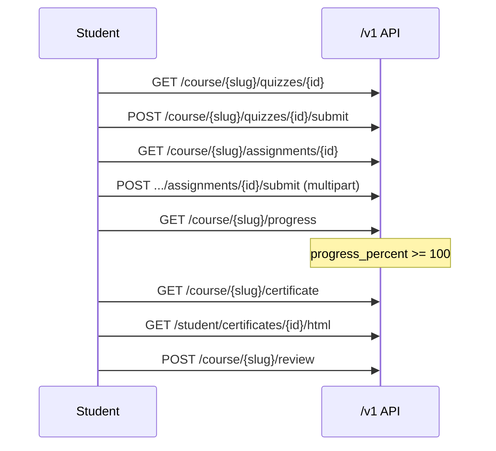

# Minar Academy — Complete Storefront API Guide

**API base:** `https://<api-host>/v1`  
**Web frontend:** `minar-academy` (`NEXT_PUBLIC_API_URL`)  
**Mobile app:** `mobile/` (`apiBaseUrl` in `mobile/src/lib/env.ts`)  
**Backend repo:** `lurnic-server/api` (Go + Gin + MySQL)

একটি মাস্টার ডকুমেন্ট — web ও mobile অ্যাপের জন্য প্রয়োজনীয় সব storefront API কীভাবে কাজ করে, কোন flow এ কোন endpoint লাগে, এবং backend implementation কোথায় আছে।

**Related per-feature docs:**  
`STUDENT_DEVICE_LOGIN_STOREFRONT_API.md` · `LESSON_VIDEO_PROGRESS_STOREFRONT_API.md` · `LESSON_OFFLINE_DOWNLOAD_STOREFRONT_API.md` · `QUIZ_STOREFRONT_API.md` · `ASSIGNMENT_STOREFRONT_API.md` · `CERTIFICATE_STOREFRONT_API.md` · `CLASS_NOTE_STOREFRONT_API.md` · `STUDENT_PROFILE_STOREFRONT_API.md` · `FREE_LESSONS_STOREFRONT_API.md`

---

## Table of contents

1. [Architecture overview](#1-architecture-overview)
2. [Base configuration](#2-base-configuration)
3. [Response & error conventions](#3-response--error-conventions)
4. [Authentication & sessions](#4-authentication--sessions)
5. [Complete endpoint index](#5-complete-endpoint-index)
6. [User journeys (how APIs connect)](#6-user-journeys-how-apis-connect)
7. [Endpoint reference by module](#7-endpoint-reference-by-module)
8. [Database migrations (new)](#8-database-migrations-new)
9. [Environment variables](#9-environment-variables)
10. [QA smoke test](#10-qa-smoke-test)
11. [Implementation status](#11-implementation-status)

---

## 1. Architecture overview



**Multi-tenant:** প্রতিটি request এ `app-key` header দিয়ে tenant identify হয় (`middleware.GetTenantID`). Student JWT তে `session_id` থাকে — single-device session enforce হয়।

**Admin vs Storefront:**
- Storefront routes: `/student/*`, `/course/*`, `/banners`, `/enrolled/*`, etc.
- Admin routes: `/private/*` (dashboard JWT, not covered here)

---

## 2. Base configuration

| Item | Web | Mobile |
|------|-----|--------|
| Base URL | `NEXT_PUBLIC_API_URL` → `https://api.example.com/v1` | `apiBaseUrl` in `mobile/src/lib/env.ts` |
| App key | `app-key: <NEXT_PUBLIC_APP_KEY>` | same |
| Auth | `Authorization: Bearer <JWT>` | auto via `mobile/src/api/client.ts` |
| Content-Type | `application/json` | same; `multipart/form-data` for uploads |

**Important:** সব storefront path `/v1` prefix এর নিচে। Example: `POST /v1/student/login`

---

## 3. Response & error conventions

### Success envelope (most endpoints)

```json
{ "data": { }, "message": "optional" }
```

### Exceptions

| Endpoint | Success shape |
|----------|----------------|
| `POST /student/login` | Top-level `{ "token", "user" }` — no `data` wrapper |
| `POST /order/create` | `{ "message", "order": { ... } }` |
| `GET /student/certificates/{id}/html` | Raw HTML (`text/html`) |

### Error body (storefront standard)

```json
{
  "message": "Human-readable error",
  "error": "OPTIONAL_MACHINE_CODE"
}
```

| HTTP | Usage |
|------|-------|
| `401` | Missing/invalid token; `error: "SESSION_REPLACED"` for single-device logout |
| `403` | Not enrolled, course incomplete, permission denied |
| `404` | Resource not found |
| `409` | Conflict (e.g. duplicate review) |
| `422` | Validation error (`error: "VALIDATION_ERROR"`) |

**Go package:** `api/internal/apiresponse` — নতুন storefront endpoints এ এই format follow করে।

---

## 4. Authentication & sessions

### Single-device sessions

প্রতি student এর **একটি active device session**। Login এ stable `device_id` পাঠাতে হবে।

| Client | `device_id` storage |
|--------|---------------------|
| Web | `localStorage` key `lurnic_device_id` |
| Mobile | AsyncStorage via `mobile/src/lib/storage.ts` |

### `POST /student/login`

```http
POST /v1/student/login
app-key: <tenant_app_key>
Content-Type: application/json

{
  "email": "student@example.com",
  "password": "secret",
  "device_id": "550e8400-e29b-41d4-a716-446655440000",
  "device_name": "Chrome on macOS"
}
```

**Success `200`:**

```json
{
  "token": "<JWT>",
  "user": {
    "id": 1,
    "user_id": "uuid-or-string",
    "first_name": "নাম",
    "last_name": "পারিবারিক",
    "email": "student@example.com",
    "phone": "01XXXXXXXXX",
    "profile_image": "https://...",
    "status": "active"
  }
}
```

### Session replaced

```json
{
  "message": "Your account was logged in on another device. Please sign in again.",
  "error": "SESSION_REPLACED"
}
```

HTTP `401` — frontend sign-out করে login page এ redirect করে।

**Backend:** `api/internal/modules/student/` · `api/internal/middleware/studentAuth.go`

---

## 5. Complete endpoint index

| Method | Path | Auth | Status |
|--------|------|------|--------|
| **Auth** | | | |
| POST | `/student/login` | app-key | ✅ |
| POST | `/student/logout` | Bearer | ✅ |
| POST | `/student/register` | app-key | ✅ |
| POST | `/student/forgot-password` | app-key | ✅ |
| POST | `/student/reset-password` | app-key | ✅ |
| **Catalog** | | | |
| GET | `/banners` | app-key | ✅ |
| GET | `/course` | app-key | ✅ |
| GET | `/course/{slug}` | app-key | ✅ |
| GET | `/course/search` | app-key | ✅ |
| GET | `/course/menu/{slug}` | app-key | ✅ |
| GET | `/course/category/{slug}` | app-key | ✅ |
| GET | `/category` | app-key | ✅ |
| GET | `/instructor/all` | app-key | ✅ |
| GET | `/payment-methods` | app-key | ✅ |
| GET | `/free-lessons` | app-key | ✅ |
| GET/POST | `/student/free-lessons` | Bearer | ✅ |
| DELETE | `/student/free-lessons/{lessonId}` | Bearer | ✅ |
| **Student** | | | |
| GET | `/student/details` | Bearer | ✅ |
| PUT | `/student/update` | Bearer (multipart) | ✅ |
| GET | `/enrolled/courses` | Bearer | ✅ (nested curriculum) |
| **Learning** | | | |
| GET | `/course/{slug}/progress` | Bearer | ✅ |
| GET/PATCH | `/course/{slug}/lessons/{lessonId}/progress` | Bearer | ✅ |
| POST | `/course/{slug}/lessons/{lessonId}/complete` | Bearer | ✅ |
| **Quizzes** | | | |
| GET | `/course/{slug}/quizzes/{quizId}` | Bearer | ✅ |
| GET | `/course/{slug}/quizzes/{quizId}/questions/{index}` | Bearer | ✅ |
| POST | `/course/{slug}/quizzes/{quizId}/submit` | Bearer | ✅ |
| POST | `/course/{slug}/quizzes/{quizId}/skip` | Bearer | ✅ |
| GET | `/student/quiz-submissions` | Bearer | ✅ |
| GET | `/student/quiz-submissions/{id}` | Bearer | ✅ |
| **Assignments** | | | |
| GET | `/course/{slug}/assignments/{assignmentId}` | Bearer | ✅ |
| POST | `/course/{slug}/assignments/{assignmentId}/submit` | Bearer (multipart) | ✅ |
| GET | `/student/assignment-submissions` | Bearer | ✅ |
| GET | `/student/assignment-submissions/{id}` | Bearer | ✅ |
| **Certificates** | | | |
| GET | `/course/{slug}/certificate` | Bearer | ✅ |
| GET | `/student/certificates` | Bearer | ✅ |
| GET | `/student/certificates/{id}` | Bearer | ✅ |
| GET | `/student/certificates/{id}/html` | Bearer | ✅ |
| **Reviews** | | | |
| GET | `/course/{slug}/reviews` | optional Bearer | ✅ |
| POST | `/course/{slug}/review` | Bearer | ✅ |
| **Academic notes** | | | |
| GET | `/academic-notes` | app-key | ✅ |
| GET | `/academic-notes/{classSlug}` | app-key | ✅ |
| GET | `/academic-notes/{classSlug}/{subjectSlug}/{paperSlug}` | app-key | ✅ |
| **Checkout** | | | |
| POST | `/order/create` | Bearer | ✅ |
| **v2** | | | |
| GET | `/student/learning-report` | Bearer | ✅ |
| GET | `/student/notifications` | Bearer | ✅ |
| PATCH | `/student/notifications/{id}/read` | Bearer | ✅ |
| GET | `/student/orders` | Bearer | ✅ |

---

## 6. User journeys (how APIs connect)

### 6.1 Browse → Enroll → Learn

```mermaid
sequenceDiagram
  participant S as Student
  participant API as /v1 API

  S->>API: GET /banners, /course, /category
  S->>API: GET /course/{slug}
  S->>API: POST /student/login
  S->>API: GET /payment-methods
  S->>API: POST /order/create
  Note over API: Order created; admin marks paid → enrollment
  S->>API: GET /enrolled/courses
  Note over API: Returns course with full course_chapters[]
  S->>API: GET /course/{slug}/progress
  loop Each lesson
    S->>API: PATCH .../lessons/{id}/progress
    S->>API: POST .../lessons/{id}/complete
  end
```

### 6.2 Assessment → Certificate → Review



### 6.3 Critical: `/enrolled/courses` nested curriculum

Frontend dashboard ও My Learning syllabus lock/unlock এর জন্য **প্রতিটি enrollment এ full course object** দরকার:

```json
{
  "data": [
    {
      "id": 1,
      "course_id": 5,
      "student_id": 12,
      "created_at": "...",
      "updated_at": "...",
      "course": {
        "id": 5,
        "title": "...",
        "slug": "...",
        "course_chapters": [
          {
            "course_lessons": [{ "id": 1, "title": "...", "is_public": false, ... }],
            "assignments": [{ "id": 2, "title": "...", "is_published": true }],
            "quizzes": [{ "id": 3, "title": "...", "is_published": true }]
          }
        ],
        "course_instructors": [],
        "general_settings": {}
      }
    }
  ]
}
```

**Backend:** `enrollment/service.go` → `course.LoadPublicCoursesByIDs()` (batch load, no N+1)

---

## 7. Endpoint reference by module

### 7.1 Catalog (public, `app-key` only)

| Endpoint | Backend module |
|----------|----------------|
| `GET /banners` | `modules/banner` |
| `GET /course` | `modules/course` — query: `showItems=<n>` or `all` |
| `GET /course/{slug}` | `modules/course` — full curriculum |
| `GET /course/search?search=` | `modules/course` |
| `GET /course/menu/{slug}` | `modules/course` — subcategory filter |
| `GET /course/category/{slug}` | `modules/course` |
| `GET /category` | `modules/category` — `sub_categories[]` |
| `GET /instructor/all` | `modules/instructor` |
| `GET /payment-methods` | `modules/payment_method` |

### 7.2 Student profile

| Endpoint | Notes |
|----------|-------|
| `GET /student/details` | `{ data: Student }` with enrollments |
| `PUT /student/update` | multipart: `first_name`, `last_name`, `phone`, `profile_image` |

### 7.3 Course progress & lessons

| Endpoint | Response key fields |
|----------|---------------------|
| `GET /course/{slug}/progress` | `progress_percent`, `completed_lesson_ids`, counts |
| `PATCH .../lessons/{id}/progress` | `{ max_position_seconds, duration_seconds }` |
| `POST .../lessons/{id}/complete` | Updated `CourseProgressData` |

**Auto-complete rule (frontend):** watch position ≥ 80% → auto POST complete.

**Backend:** `modules/courseprogress` · `internal/progress/course.go`

### 7.4 Quizzes & Assignments

See dedicated docs: `QUIZ_STOREFRONT_API.md`, `ASSIGNMENT_STOREFRONT_API.md`

### 7.5 Certificates

See `CERTIFICATE_STOREFRONT_API.md`

- `GET /course/{slug}/certificate` — `404` = not unlocked yet
- `GET /student/certificates/{id}/html` — raw HTML for WebView/print

### 7.6 Course reviews (NEW)

**`GET /course/{slug}/reviews`**

- Auth optional (`OptionalStudentAuthMiddleware`)
- Query: `page` (default 1), `per_page` (default 20, max 50)
- Bearer থাকলে `student_review` ও `can_review` return করে

**`POST /course/{slug}/review`**

```json
{
  "rating": 5,
  "comment": "optional, max 2000 chars",
  "tags": ["excellent_content", "excellent_teaching"]
}
```

**Allowed tags:** `excellent_content`, `excellent_teaching`, `sufficient_resources`, `others`

**Errors:**

| HTTP | error code |
|------|------------|
| 403 | `NOT_ENROLLED` |
| 403 | `COURSE_NOT_COMPLETED` |
| 409 | `REVIEW_ALREADY_EXISTS` |
| 422 | `VALIDATION_ERROR` |

**Business rules:**
- Enrolled + `progress_percent >= 100`
- One review per student per course (`UNIQUE course_id, student_id`)

**Backend:** `modules/coursereview` · migration `00063_create_course_reviews_table.sql`

### 7.7 Academic notes

See `CLASS_NOTE_STOREFRONT_API.md`

### 7.8 Checkout

**`POST /order/create`**

```json
{
  "course_id": 5,
  "payment_method": "bKash",
  "transaction_id": "TXN123456"
}
```

Free courses: `payment_method` ও `transaction_id` null হতে পারে।

**Success:**

```json
{
  "message": "Order placed successfully",
  "order": {
    "course_id": 5,
    "invoice_id": 1,
    "total": 1500,
    "customer_note": ""
  }
}
```

Admin `Mark as paid` করলে auto-enrollment হয় (`order/service.go` → `MarkAsPaid`).

### 7.9 v2 APIs (NEW)

#### `GET /student/learning-report?period=7d|30d|90d`

`daily_watch_seconds` comes from `student_daily_watch` (actual play time via `POST /student/watch-time`). See [STUDENT_WATCH_TIME_STOREFRONT_API.md](./STUDENT_WATCH_TIME_STOREFRONT_API.md).

```json
{
  "data": {
    "period": "7d",
    "daily_watch_seconds": [
      { "date": "2026-03-01", "seconds": 3600 }
    ],
    "streak_days": 3,
    "quiz_accuracy_percent": 85.5,
    "courses_in_progress": 2,
    "courses_completed": 1
  }
}
```

#### `POST /student/watch-time` · `POST /student/watch-time/batch`

Ingest actual video play deltas (idempotent `client_event_id`). Full contract: [STUDENT_WATCH_TIME_STOREFRONT_API.md](./STUDENT_WATCH_TIME_STOREFRONT_API.md).

#### `GET /student/notifications`

Returns `StudentNotification[]` — empty array যদি কোনো notification না থাকে।

#### `PATCH /student/notifications/{id}/read`

Marks notification as read.

#### `GET /student/orders`

Returns order history with course title, payment status, invoice_id.

**Backend:** `modules/student/storefront_*.go` · migration `00064_create_student_notifications_table.sql`

---

## 8. Database migrations (new)

Deploy এর আগে run করুন:

```bash
cd api
goose -dir migrations mysql "$GOOSE_DBSTRING" up
```

| Migration | Table |
|-----------|-------|
| `00063_create_course_reviews_table.sql` | `course_reviews` |
| `00064_create_student_notifications_table.sql` | `student_notifications` |

---

## 9. Environment variables

| Variable | Platform | Purpose |
|----------|----------|---------|
| `NEXT_PUBLIC_API_URL` | Web | API base URL (include `/v1`) |
| `NEXT_PUBLIC_APP_KEY` | Web + Mobile | `app-key` header |
| `JWT_SECRET` | API | Student/admin JWT signing |
| `GOOSE_DBSTRING` | API | MySQL connection |
| `AUTH_SECRET` | Web (NextAuth) | Session signing — not sent to API |

**After env change:** redeploy web (build-time vars); restart mobile dev build.

---

## 10. QA smoke test

```bash
API_URL="https://api.example.com/v1"
APP_KEY="your-app-key"
TOKEN="student-jwt"

# Public catalog
curl -s "$API_URL/banners" -H "app-key: $APP_KEY"
curl -s "$API_URL/course/my-slug" -H "app-key: $APP_KEY"
curl -s "$API_URL/category" -H "app-key: $APP_KEY"

# Auth
curl -s -X POST "$API_URL/student/login" -H "app-key: $APP_KEY" \
  -H "Content-Type: application/json" \
  -d '{"email":"test@example.com","password":"secret","device_id":"test-device-0001"}'

# Enrolled courses (must include course_chapters)
curl -s "$API_URL/enrolled/courses" \
  -H "app-key: $APP_KEY" -H "Authorization: Bearer $TOKEN"

# Progress
curl -s "$API_URL/course/my-slug/progress" \
  -H "app-key: $APP_KEY" -H "Authorization: Bearer $TOKEN"

# Lesson complete
curl -s -X POST "$API_URL/course/my-slug/lessons/42/complete" \
  -H "app-key: $APP_KEY" -H "Authorization: Bearer $TOKEN"

# Reviews
curl -s "$API_URL/course/my-slug/reviews" -H "app-key: $APP_KEY"
curl -s -X POST "$API_URL/course/my-slug/review" \
  -H "app-key: $APP_KEY" -H "Authorization: Bearer $TOKEN" \
  -H "Content-Type: application/json" \
  -d '{"rating":5,"comment":"Great course!"}'

# v2
curl -s "$API_URL/student/learning-report?period=30d" \
  -H "app-key: $APP_KEY" -H "Authorization: Bearer $TOKEN"
curl -s "$API_URL/student/orders" \
  -H "app-key: $APP_KEY" -H "Authorization: Bearer $TOKEN"
curl -s "$API_URL/student/notifications" \
  -H "app-key: $APP_KEY" -H "Authorization: Bearer $TOKEN"

# Checkout
curl -s -X POST "$API_URL/order/create" \
  -H "app-key: $APP_KEY" -H "Authorization: Bearer $TOKEN" \
  -H "Content-Type: application/json" \
  -d '{"course_id":5,"payment_method":"bKash","transaction_id":"TXN123"}'
```

---

## 11. Implementation status

| Priority | Area | Status | Backend location |
|----------|------|--------|------------------|
| P0 | Auth + sessions | ✅ | `modules/student`, `middleware/studentAuth` |
| P0 | Catalog | ✅ | `modules/course`, `banner`, `category`, etc. |
| P0 | Enrolled courses (nested) | ✅ | `enrollment/service.go` + `course/public_mapper.go` |
| P0 | Lesson progress + complete | ✅ | `modules/courseprogress` |
| P1 | Quizzes | ✅ | `modules/quiz` |
| P1 | Assignments | ✅ | `modules/assignment` |
| P1 | Certificates | ✅ | `modules/certificate` |
| P1 | Checkout | ✅ | `modules/order` |
| P2 | Course reviews | ✅ | `modules/coursereview` |
| P2 | Academic notes | ✅ | `modules/academicnote` |
| P3 | Learning report | ✅ | `modules/student/storefront_service.go` |
| P3 | Notifications | ✅ | `student_notifications` table + storefront |
| P3 | Order history | ✅ | `GET /student/orders` |

### Recent changes (March 2026)

1. **`GET /enrolled/courses`** — এখন প্রতিটি `course` object এ full `course_chapters[]` (lessons, assignments, quizzes) return করে
2. **`POST /student/login`** — user object এ `id`, `first_name`, `last_name`, `profile_image`, `status` (string)
3. **Course reviews** — `GET/POST /course/{slug}/reviews|review`
4. **Error format** — storefront endpoints এ `{ message, error }` standard (`apiresponse` package)
5. **v2** — learning report, notifications, order history
6. **Order message** — `"Order placed successfully"`

### Frontend type contracts

| Platform | Types file |
|----------|------------|
| Web | `types/index.d.ts` |
| Mobile | `mobile/src/types/api.ts` |

Frontend ইতিমধ্যে এই contract ধরে বানানো — backend deploy + migration run করলে অতিরিক্ত frontend কাজ লাগবে না।

---

*Document version: 3.0 — complete implementation guide. Last updated: March 2026.*
