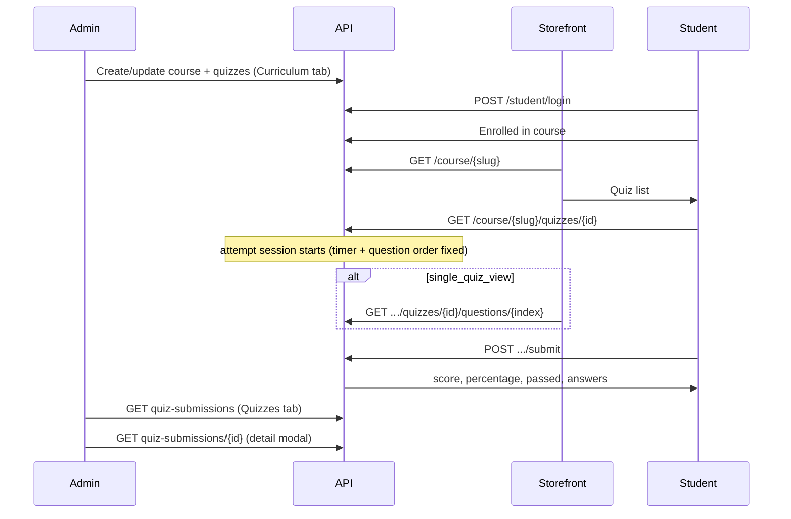

# Quiz — Storefront API, Admin & Submission Guide

**API base:** `https://<api-host>/v1`  
**Admin dashboard:** `https://<dashboard-host>/courses/{id}/update?tab=Quizzes`

এই doc এ quiz এর পুরো flow আছে — admin এ quiz তৈরি, storefront এ student দেখা/submit, result, আর admin এ submission review।

---

## Quick reference — সব endpoint

| Who | Method | Path | Headers |
|-----|--------|------|---------|
| Public | `GET` | `/course/{slug}` | `app-key` |
| Student | `GET` | `/course/{slug}/quizzes/{quizId}` | `app-key` + `Bearer` |
| Student | `GET` | `/course/{slug}/quizzes/{quizId}/questions/{questionIndex}` | `app-key` + `Bearer` |
| Student | `POST` | `/course/{slug}/quizzes/{quizId}/submit` | `app-key` + `Bearer` |
| Student | `GET` | `/student/quiz-submissions?course_id=` | `app-key` + `Bearer` |
| Student | `POST` | `/student/login` | `app-key` |
| Admin | `POST` | `/private/course/create` | `Bearer` (multipart) |
| Admin | `PUT` | `/private/course/update/{id}` | `Bearer` (multipart) |
| Admin | `GET` | `/private/course/{courseId}/quiz-submissions` | `Bearer` |
| Admin | `GET` | `/private/course/{courseId}/quiz-submissions/{submissionId}` | `Bearer` |

- **Student routes:** `Authorization: Bearer <student_jwt>` (from `/student/login`)
- **Admin routes:** `Authorization: Bearer <admin_jwt>` (from `/user/login`)
- **Public/student tenant routes:** `app-key: <tenant_app_key>`

---

## End-to-end flow



---

## Part 1 — Admin: Quiz তৈরি ও manage

### 1.1 Curriculum তে quiz add

1. **Courses → Create/Edit → Curriculum**
2. Chapter এ **+ → Quiz**
3. Title, optional instructions, settings, **Add Questions**
4. প্রতিটি question এ:
   - **Single choice / Multiple choice:** options + correct answer (radio/checkbox)
   - **True/False:** True বা False select
5. Quiz **Save** → পুরো course **Save**

Quiz **published** (`is_published: true`) হলে storefront এ দেখা যাবে।  
প্রতিটি question এ **correct answer** থাকলে auto-grade কাজ করবে।

### 1.2 Quiz settings (API + UI)

| Field | Type | Required | Special values | Behaviour |
|-------|------|----------|----------------|-----------|
| `title` | string | ✅ | — | Quiz title |
| `instructions` | string | ❌ | empty allowed | Rich text; optional |
| `is_published` | boolean | — | — | `false` হলে student attempt করতে পারবে না |
| `randomize_questions` | boolean | — | — | প্রতি attempt-এ question order shuffle হয় (session-এ fixed) |
| `single_quiz_view` | boolean | — | — | `true` হলে এক সময়ে একটা question; paginated endpoint ব্যবহার করো |
| `time_limit` | number | ✅ | `0` = no limit | Timer শুরু হয় attempt session create হলে |
| `time_limit_option` | enum | — | `minutes`, `hours`, `days`, `weeks`, `months` | `time_limit` এর unit |
| `total_visible_questions` | number | — | `0` = all | Attempt-এ কতটা question দেখাবে |
| `reveal_answers` | boolean | — | — | Submit-এর পর correct answer + explanation |
| `enable_retry` | boolean | — | — | `false` = শুধু ১ attempt |
| `retry_attempts` | number | — | `0` = unlimited | শুধু `enable_retry: true` হলে কার্যকর; UI-তো তখনই দেখায় |
| `minimum_pass_percentage` | number | ✅ | `0`–`100` | `passed = percentage >= minimum_pass_percentage` |

**Admin UI notes:**

- **Instructions** — optional (no asterisk)
- **Retry Attempts** — শুধু **Enable Retry** on থাকলে দেখায়
- **Time Limit `0`** — no time limit
- **Total Visible Questions `0`** — সব question দেখাবে

### 1.3 Question fields (API + UI)

| Field | Type | UI | Notes |
|-------|------|-----|-------|
| `title` | string | ✅ | Required |
| `type` | `single_choice` \| `multiple_choice` \| `true_false` | ✅ | |
| `marks` | number | ✅ | |
| `options` | `[{ id, text }]` | ✅ | MCQ তে required (min 2) |
| `correct_answer` | JSON | ✅ | Auto-grade এর জন্য |
| `answer_explanation` | HTML string | ✅ | Optional; reveal হলে student দেখবে |
| `answer_required` | boolean | ✅ | Submit-এ empty থাকলে reject |

**`correct_answer` format:**

```json
// single_choice
{ "value": "a" }

// true_false
{ "value": true }

// multiple_choice
{ "values": ["a", "c"] }
```

**`options` example:**

```json
[
  { "id": "a", "text": "Markup language" },
  { "id": "b", "text": "Programming language" }
]
```

Course save এ `course_chapters` JSON এর ভিতরে `quizzes[].questions[]` হিসেবে যায় (`PUT /private/course/update/{id}` বা `POST /private/course/create`).

**Example quiz payload (course chapter JSON):**

```json
{
  "title": "HTML Basics Quiz",
  "instructions": "",
  "is_published": true,
  "randomize_questions": true,
  "single_quiz_view": false,
  "time_limit": 30,
  "time_limit_option": "minutes",
  "total_visible_questions": 0,
  "reveal_answers": true,
  "enable_retry": true,
  "retry_attempts": 2,
  "minimum_pass_percentage": 60,
  "questions": []
}
```

### 1.4 Admin: Submission review (Dashboard)

**Course Edit → Quizzes tab** (`?tab=Quizzes`)

| Feature | আছে |
|---------|-----|
| সব submission list | ✅ |
| Quiz / chapter / student name / email | ✅ |
| Marks `score/max_score (%)` | ✅ |
| Status filter (All / Evaluate / Pending) | ✅ |
| Row click → **detail modal** | ✅ |
| Per-question answers, correct/incorrect, explanation | ✅ |
| Manual mark edit | ❌ (দরকার নেই যদি সব question auto-grade হয়) |

**Evaluate** filter = `status: pending_review` (যেখানে `correct_answer` ছিল না বা grade হয়নি)।

Detail modal API call করে:

```http
GET /v1/private/course/{courseId}/quiz-submissions/{submissionId}
Authorization: Bearer <admin_token>
```

Admin detail এ সবসময় **correct answer + explanation** দেখায় (review এর জন্য)।

---

## Part 2 — Storefront: Quiz দেখানো

### 2.1 Course page — quiz list

```http
GET /v1/course/{course-slug}
app-key: <tenant_app_key>
```

Published quiz গুলো `data.course_chapters[].quizzes[]` তে আসে।

**পাঠানো হয়:** `id`, `title`, `instructions`, settings, `questions[]` (with `options`)  
**পাঠানো হয় না:** `correct_answer`, `answer_explanation` (security)

> Public course response সব question দেখায় (preview/listing)। Actual attempt-এ student authenticated endpoint ব্যবহার করবে — সেখানে session, timer, randomize/limit apply হয়।

**Storefront UI:**
1. Course load করো
2. Chapter অনুযায়ী quiz cards দেখাও
3. “Start quiz” → enrolled student হলে `GET .../quizzes/{id}` call করো (attempt session শুরু)

### 2.2 Quiz attempt — start session (enrolled student only)

```http
GET /v1/course/{course-slug}/quizzes/{quizId}
app-key: <tenant_app_key>
Authorization: Bearer <student_token>
```

এই call **attempt session** তৈরি/পুনরায় ব্যবহার করে (`quiz_attempt_sessions` table)। এক attempt-এর মধ্যে:

- Question order **fixed** থাকে (randomize/limit একবার apply হয়)
- Timer শুরু হয় (`time_limit > 0` হলে)
- Page refresh করলে same session reuse হয় (timer reset হয় না)

**Response fields (quiz object + attempt metadata):**

| Field | Meaning |
|-------|---------|
| `attempts_used` | আগে কতবার submit/forfeit হয়েছে |
| `can_retry` | আবার নতুন attempt করা যাবে কিনা |
| `attempt_number` | বর্তমান attempt (1-based) |
| `display_mode` | `"all"` বা `"single"` |
| `total_questions` | এই attempt-এ মোট কত question |
| `current_question_index` | Single view-এ প্রথম question = `0` |
| `started_at` | ISO 8601 — session শুরুর সময় |
| `expires_at` | ISO 8601 — time limit থাকলে |
| `seconds_remaining` | Timer countdown (null = no limit) |
| `questions[]` | Attempt-এ visible questions (`single` mode-এ প্রথমটা only) |

**Example response (abbreviated):**

```json
{
  "data": {
    "id": 9,
    "title": "HTML Basics Quiz",
    "instructions": "",
    "single_quiz_view": true,
    "time_limit": 30,
    "time_limit_option": "minutes",
    "randomize_questions": true,
    "total_visible_questions": 0,
    "reveal_answers": true,
    "enable_retry": true,
    "retry_attempts": 2,
    "minimum_pass_percentage": 60,
    "attempts_used": 0,
    "can_retry": true,
    "attempt_number": 1,
    "display_mode": "single",
    "total_questions": 5,
    "current_question_index": 0,
    "started_at": "2026-07-07T00:30:00Z",
    "expires_at": "2026-07-07T01:00:00Z",
    "seconds_remaining": 1800,
    "questions": [
      {
        "id": 41,
        "title": "What is HTML?",
        "type": "single_choice",
        "options": [{ "id": "a", "text": "Markup language" }]
      }
    ]
  }
}
```

**Errors:**

| HTTP | Reason |
|------|--------|
| `403` | Enrolled নয় |
| `404` | Course/quiz নেই বা unpublished |
| `400` | `quiz retry is disabled` |
| `400` | `maximum quiz attempts reached` |

### 2.3 Single quiz view — paginated questions

`single_quiz_view: true` হলে পরের question-গুলো এই endpoint দিয়ে load করো:

```http
GET /v1/course/{course-slug}/quizzes/{quizId}/questions/{questionIndex}
app-key: <tenant_app_key>
Authorization: Bearer <student_token>
```

- `questionIndex` = **0-based** (`0` = first, `total_questions - 1` = last)
- Same active attempt session ব্যবহার করে (timer + order consistent)
- `single_quiz_view: false` হলে `400 single quiz view is disabled for this quiz`

**Response fields:**

| Field | Meaning |
|-------|---------|
| `question_index` | যে index request করা হয়েছে |
| `total_questions` | attempt-এ মোট question |
| `display_mode` | `"single"` |
| `started_at`, `expires_at`, `seconds_remaining` | Timer info |
| (question fields) | `id`, `title`, `type`, `options`, … |

**Storefront UI flow (`single_quiz_view`):**

1. `GET .../quizzes/{id}` → question `0` + metadata
2. Next button → `GET .../questions/1`, then `2`, …
3. Last question-এ Submit → `POST .../submit`

### 2.4 Quiz settings → storefront behaviour

| Setting | API enforcement | Storefront UI |
|---------|-------------------|---------------|
| `is_published` | Unpublished = 404 on attempt | Hide or disable unpublished quizzes |
| `randomize_questions` | ✅ Per-attempt shuffle (session-fixed) | No extra work |
| `total_visible_questions` | ✅ `0` = all; `N` = subset | Show `total_questions` from response |
| `time_limit` + `time_limit_option` | ✅ Server enforces on submit; auto-forfeit on expiry | Render countdown from `seconds_remaining` |
| `single_quiz_view` | ✅ First Q on main GET; rest via `/questions/{index}` | Paginate UI |
| `reveal_answers` | ✅ On submit response | Show/hide correct answers |
| `enable_retry` + `retry_attempts` | ✅ Server enforces | Show retry if `can_retry: true` |
| `minimum_pass_percentage` | ✅ Sets `passed` on submit | Pass/fail badge |

### 2.5 Time limit behaviour

| `time_limit` | Behaviour |
|--------------|-----------|
| `0` | No timer; `expires_at` / `seconds_remaining` = null |
| `> 0` | Session `started_at` থেকে countdown; unit = `time_limit_option` |

**On expiry (server-side):**

- Active session expire হলে পরের `GET` attempt **auto-forfeit** করে (0 score, `passed: false`)
- `POST .../submit` after expiry → `400 quiz time limit exceeded`
- Forfeit-ও একটা attempt হিসেবে গণনা হয় (`attempts_used` বাড়ে)

**Storefront recommendation:** `seconds_remaining` দিয়ে countdown দেখাও; `0` হলে submit disable করো বা auto-submit করো।

---

## Part 3 — Student: Submit ও Result

### 3.1 Submit

```http
POST /v1/course/{course-slug}/quizzes/{quizId}/submit
app-key: <tenant_app_key>
Authorization: Bearer <student_token>
Content-Type: application/json
```

```json
{
  "answers": [
    { "question_id": 41, "value": "a" },
    { "question_id": 42, "value": true },
    { "question_id": 43, "value": ["a", "c"] }
  ]
}
```

| Question type | `value` |
|---------------|---------|
| `single_choice` | `"a"` (option `id`) |
| `true_false` | `true` or `false` |
| `multiple_choice` | `["a", "c"]` |

**Submit rules:**

- Answers শুধু **current attempt session-এর question order/subset** থেকে হতে হবে
- `answer_required: true` question খালি থাকলে `400`
- Time limit expired হলে `400 quiz time limit exceeded`
- Successful submit session `submitted_at` mark করে

### 3.2 Submit response — student কী দেখবে

**Success `201` — storefront এ result screen এ এগুলো render করো:**

```json
{
  "message": "Quiz submitted successfully",
  "data": {
    "id": 101,
    "quiz_title": "HTML Basics Quiz",
    "attempt_number": 1,
    "score": 4,
    "max_score": 5,
    "percentage": 80,
    "passed": true,
    "status": "graded",
    "submitted_at": "2026-07-07T01:00:00Z",
    "reveal_answers": true,
    "answers": [
      {
        "question_id": 41,
        "question_title": "What is HTML?",
        "question_type": "single_choice",
        "submitted_answer": "a",
        "is_correct": true,
        "marks_awarded": 1,
        "correct_answer": { "value": "a" },
        "answer_explanation": "HTML is a markup language."
      }
    ]
  }
}
```

| Field | UI তে দেখাও |
|-------|-------------|
| `score` / `max_score` | **“You scored 4/5”** |
| `percentage` | **“80%”** |
| `passed` | Pass / Fail badge |
| `status` | `graded` = final; `pending_review` = “Under review” |
| `answers[].marks_awarded` | Per-question marks |
| `answers[].is_correct` | ✓ / ✗ (null = pending) |
| `correct_answer` | শুধু যখন quiz `reveal_answers: true` |
| `answer_explanation` |同上 |

> **Note:** এই repo তে student storefront UI নেই — তোমার learner app এ submit response bind করতে হবে।

### 3.3 Grading rules

| Condition | `status` | Score |
|-----------|----------|-------|
| সব question এ `correct_answer` আছে | `graded` | Auto-calculated |
| কোনো question এ `correct_answer` নেই | `pending_review` | Partial/0 until review |
| `passed` | — | `percentage >= minimum_pass_percentage` |
| Time limit expired (auto-forfeit) | `graded` | `0` / `passed: false` |

### 3.4 Retry

| Quiz setting | Behaviour |
|--------------|-----------|
| `enable_retry: false` | ১ বার attempt (submit বা forfeit) |
| `enable_retry: true`, `retry_attempts: N` (N > 0) | সর্বোচ্চ N attempt |
| `enable_retry: true`, `retry_attempts: 0` | **Unlimited** attempts |
| Retry শেষ | `GET` quiz → `400 maximum quiz attempts reached` |

### 3.5 Submission history (পরে আবার দেখতে)

```http
GET /v1/student/quiz-submissions?course_id=12
app-key: <tenant_app_key>
Authorization: Bearer <student_token>
```

`course_id` optional। List এ `score`, `max_score`, `percentage`, `passed`, `submitted_at` পাবে।

---

## Part 4 — Auth & enrollment

### Student login

```http
POST /v1/student/login
app-key: <tenant_app_key>
Content-Type: application/json

{
  "email": "student@example.com",
  "password": "secret"
}
```

Response: `{ "token": "...", "user": { ... } }`

### Enrollment

Quiz attempt/submit এর আগে student কে course এ **enroll** করতে হবে (`enrollments` table / admin enrollment API)।  
না থাকলে: `403 enrollment required`.

---

## Part 5 — Deploy

### Migrations (required)

```bash
cd api
goose -dir migrations mysql "<GOOSE_DBSTRING>" up
```

| Migration | Table/column |
|-----------|----------------|
| `00040` | `quiz_questions.options` |
| `00041` | `quiz_questions.correct_answer` |
| `00042` | `quiz_submissions` |
| `00043` | `quiz_submission_answers` |
| `00055` | `quiz_attempt_sessions` (timer + fixed question order per attempt) |

তারপর **API + web** redeploy।

### Env (storefront)

| Var | Example |
|-----|---------|
| `NEXT_PUBLIC_API_URL` | `https://api.example.com/v1` |
| Storefront `app-key` | Tenant এর `app_key` |

---

## Part 6 — cURL examples

```bash
# 1) Public course + quizzes
curl -s -H "app-key: TENANT_KEY" \
  "https://api.example.com/v1/course/react-masterclass"

# 2) Student login
TOKEN=$(curl -s -X POST \
  -H "app-key: TENANT_KEY" \
  -H "Content-Type: application/json" \
  -d '{"email":"s@example.com","password":"pass"}' \
  https://api.example.com/v1/student/login | jq -r .token)

# 3) Start quiz attempt (creates/reuses session + timer)
curl -s \
  -H "app-key: TENANT_KEY" \
  -H "Authorization: Bearer $TOKEN" \
  "https://api.example.com/v1/course/react-masterclass/quizzes/9"

# 4) Single quiz view — load question 2 (0-based index)
curl -s \
  -H "app-key: TENANT_KEY" \
  -H "Authorization: Bearer $TOKEN" \
  "https://api.example.com/v1/course/react-masterclass/quizzes/9/questions/1"

# 5) Submit
curl -s -X POST \
  -H "app-key: TENANT_KEY" \
  -H "Authorization: Bearer $TOKEN" \
  -H "Content-Type: application/json" \
  -d '{"answers":[{"question_id":41,"value":"a"}]}' \
  "https://api.example.com/v1/course/react-masterclass/quizzes/9/submit"

# 6) Admin — list submissions
curl -s \
  -H "Authorization: Bearer $ADMIN_TOKEN" \
  "https://api.example.com/v1/private/course/12/quiz-submissions"

# 7) Admin — submission detail
curl -s \
  -H "Authorization: Bearer $ADMIN_TOKEN" \
  "https://api.example.com/v1/private/course/12/quiz-submissions/101"
```

---

## Feature matrix (latest)

| Feature | Status | Where |
|---------|--------|-------|
| Admin quiz create/edit (Curriculum) | ✅ | Dashboard |
| Optional quiz instructions | ✅ | Quiz edit form |
| Quiz settings (publish, randomize, timer, retry, pass %) | ✅ | Quiz edit + API |
| Question options + correct answer UI | ✅ | Add/Edit Question modal |
| Course save with quizzes | ✅ | Create/Update course API |
| Storefront quiz list | ✅ API | `GET /course/{slug}` |
| Student quiz attempt + session | ✅ API | `GET .../quizzes/{id}` |
| Single-question pagination | ✅ API | `GET .../questions/{index}` |
| Time limit (server enforced) | ✅ API | Session + submit validation |
| Randomize + visible question limit | ✅ API | Per-attempt session order |
| Student submit + instant result | ✅ API | `POST .../submit` |
| Student submission history | ✅ API | `GET /student/quiz-submissions` |
| Auto-grading | ✅ | `correct_answer` on questions |
| Admin submission list | ✅ | Course Edit → **Quizzes** tab |
| Admin submission detail (modal) | ✅ | Click row in Quizzes tab |
| Manual grading / mark override | ❌ | Not built |
| Student storefront result UI | ❌ | Build in learner app |

---

## Storefront implementation checklist

- [ ] `GET /course/{slug}` → render `course_chapters[].quizzes[]`
- [ ] Student login; store JWT
- [ ] Verify enrollment (or handle `403`)
- [ ] **Start attempt:** `GET /course/{slug}/quizzes/{id}` (session + timer begins)
- [ ] If `display_mode === "single"`: paginate with `GET .../questions/{index}`
- [ ] Else: build form from `questions[]` + `options`
- [ ] Show countdown from `seconds_remaining` (if present)
- [ ] `POST .../submit` before timer hits 0
- [ ] Result screen: `score`, `max_score`, `percentage`, `passed`
- [ ] If `reveal_answers`: show `correct_answer`, `answer_explanation` per question
- [ ] Retry button only if `can_retry: true` on next `GET` quiz
- [ ] Handle `400 quiz time limit exceeded` gracefully
- [ ] Optional: history via `GET /student/quiz-submissions`

---

## Related files (codebase)

| Area | Path |
|------|------|
| Quiz API module | `api/internal/modules/quiz/` |
| Attempt session model | `api/internal/models/quiz_attempt_session.go` |
| Course quiz CRUD | `api/internal/modules/course/service.go` |
| Admin quiz form | `frontend/.../curriculum/QuizEdit.tsx` |
| Admin Quizzes tab | `frontend/.../CoursesTabs.tsx` |
| Submission table | `frontend/.../quiz-evaluation/QuizTable.tsx` |
| Submission detail modal | `frontend/.../quiz-evaluation/QuizSubmissionDetailModal.tsx` |
| Question form | `frontend/.../curriculum/AddNewQuestion.tsx`, `QuizQuestionAnswerFields.tsx` |
| Migrations | `api/migrations/00040` – `00043`, `00055` |
