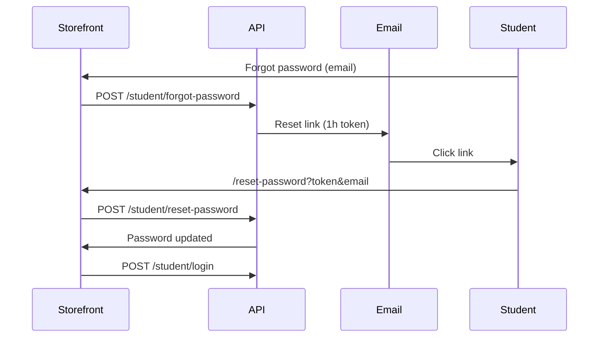

# Student Forgot Password — Storefront API

**API base:** `https://<api-host>/v1`

Student password reset storefront থেকে handle করার জন্য এই doc।  
সব request এ **`app-key: <tenant_app_key>`** header লাগবে (যেমন login/register এ)।

---

## Status

| Layer | Status |
|-------|--------|
| API `POST /student/forgot-password` | ✅ Ready |
| API `POST /student/reset-password` | ✅ Ready |
| Admin dashboard forgot-password UI | ⚠️ Stub only (API call নেই) |
| Storefront integration | আপনার storefront এ implement করতে হবে |

---

## Quick reference

| Step | Method | Path | Auth |
|------|--------|------|------|
| Request reset link | `POST` | `/student/forgot-password` | `app-key` |
| Set new password | `POST` | `/student/reset-password` | `app-key` |
| Login after reset | `POST` | `/student/login` | `app-key` |

---

## End-to-end flow



---

## Part 1 — Forgot password (email দিয়ে link চাওয়া)

### Request

```http
POST /v1/student/forgot-password
app-key: <tenant_app_key>
Content-Type: application/json

{
  "email": "student@example.com",
  "reset_url": "https://your-storefront.com/reset-password"
}
```

| Field | Required | Notes |
|-------|----------|-------|
| `email` | ✅ | Student signup এ যে email ব্যবহার করেছে |
| `reset_url` | ✅ | Storefront এর reset page URL (**query string ছাড়া**)। API এ `token` ও `email` query append করবে |

### Success response `200`

```json
{
  "message": "If an account exists for this email, a password reset link has been sent."
}
```

**Security:** Email DB তে না থাকলেও একই message — email enumeration ঠেকাতে।

### Dev mode (`GIN_MODE=debug`, SMTP configure না থাকলে)

```json
{
  "message": "If an account exists for this email, a password reset link has been sent.",
  "dev_reset_link": "https://your-storefront.com/reset-password?email=...&token=...",
  "dev_reset_token": "eyJhbG..."
}
```

Production এ SMTP configure না থাকলে `503`:

```json
{ "error": "Password reset email is not configured" }
```

### Errors

| Status | When |
|--------|------|
| `400` | Invalid email / invalid `reset_url` |
| `503` | Production, SMTP missing |
| `500` | Email send failed |

---

## Part 2 — Reset password (নতুন password set)

Student email link এ click করলে storefront page এ যাবে:

```
https://your-storefront.com/reset-password?token=<jwt>&email=student%40example.com
```

### Request

```http
POST /v1/student/reset-password
app-key: <tenant_app_key>
Content-Type: application/json

{
  "email": "student@example.com",
  "token": "eyJhbG...",
  "password": "newSecret123"
}
```

| Field | Required | Notes |
|-------|----------|-------|
| `email` | ✅ | URL query থেকে |
| `token` | ✅ | URL query থেকে (1 ঘণ্টা valid JWT) |
| `password` | ✅ | Min 6 characters |

### Success `200`

```json
{
  "message": "Password updated successfully"
}
```

তারপর `POST /student/login` দিয়ে নতুন password এ login।

### Errors

| Status | Body |
|--------|------|
| `400` | `{ "error": "Invalid or expired reset token" }` |
| `400` | Validation errors (`password` min 6, etc.) |

---

## Part 3 — Storefront UI checklist

### Page 1: `/forgot-password`

1. Email input form
2. Submit → `POST /student/forgot-password` with your reset page URL:

```ts
await fetch(`${API_URL}/student/forgot-password`, {
  method: "POST",
  headers: {
    "Content-Type": "application/json",
    "app-key": TENANT_APP_KEY,
  },
  body: JSON.stringify({
    email,
    reset_url: "https://your-storefront.com/reset-password",
  }),
});
```

3. Success message দেখান (email পাঠানো হয়েছে — account না থাকলেও same message)

### Page 2: `/reset-password`

1. URL থেকে `token` ও `email` read করুন (`useSearchParams` / `URLSearchParams`)
2. New password + confirm password form
3. Submit → `POST /student/reset-password`
4. Success হলে login page এ redirect

```ts
const params = new URLSearchParams(window.location.search);
const token = params.get("token");
const email = params.get("email");

await fetch(`${API_URL}/student/reset-password`, {
  method: "POST",
  headers: {
    "Content-Type": "application/json",
    "app-key": TENANT_APP_KEY,
  },
  body: JSON.stringify({
    email,
    token,
    password: newPassword,
  }),
});
```

### Token storage

- Reset token **localStorage/session এ save করবেন না** — শুধু URL query থেকে একবার use করুন
- Expired হলে user কে আবার forgot-password flow এ পাঠান

---

## Part 4 — API server env (Coolify / deploy)

| Var | Example | Required |
|-----|---------|----------|
| `JWT_SECRET` | long random string | ✅ |
| `SMTP_HOST` | `smtp.resend.com` | ✅ prod |
| `SMTP_PORT` | `587` | ✅ prod |
| `SMTP_USER` | SMTP username | যদি provider চায় |
| `SMTP_PASSWORD` | SMTP password | যদি provider চায় |
| `SMTP_FROM` | `noreply@yourdomain.com` | ✅ prod |
| `GIN_MODE` | `release` | prod |

`.env.example` এ placeholder আছে।

**Email providers:** Resend, SendGrid, Mailgun, Amazon SES — যেকোনো SMTP-compatible service কাজ করবে।

---

## Part 5 — cURL examples

```bash
API="https://api.example.com/v1"
KEY="TENANT_APP_KEY"

# 1) Request reset email
curl -s -X POST "$API/student/forgot-password" \
  -H "app-key: $KEY" \
  -H "Content-Type: application/json" \
  -d '{
    "email": "student@example.com",
    "reset_url": "https://storefront.example.com/reset-password"
  }'

# 2) Reset password (token from email link)
curl -s -X POST "$API/student/reset-password" \
  -H "app-key: $KEY" \
  -H "Content-Type: application/json" \
  -d '{
    "email": "student@example.com",
    "token": "PASTE_TOKEN_FROM_EMAIL",
    "password": "newSecret123"
  }'

# 3) Login with new password
curl -s -X POST "$API/student/login" \
  -H "app-key: $KEY" \
  -H "Content-Type: application/json" \
  -d '{"email":"student@example.com","password":"newSecret123","device_id":"550e8400-e29b-41d4-a716-446655440000"}'
```

---

## Part 6 — Related endpoints

| Endpoint | Purpose |
|----------|---------|
| `POST /student/login` | Login after reset (`device_id` required — see [STUDENT_DEVICE_LOGIN_STOREFRONT_API.md](./STUDENT_DEVICE_LOGIN_STOREFRONT_API.md)) |
| `POST /student/register` | New student signup |
| `GET /student/details` | Profile (Bearer token) |

Quiz/Assignment storefront docs: `docs/QUIZ_STOREFRONT_API.md`, `docs/ASSIGNMENT_STOREFRONT_API.md`

---

## Notes

- Reset token **1 hour** valid; তারপর নতুন forgot-password request করতে হবে
- Token শুধু **password reset** এর জন্য — quiz/assignment API তে Bearer হিসেবে use করা যাবে না
- `students.otp_code` DB column আছে কিন্তু এই flow JWT ব্যবহার করে — extra migration লাগে না
- Admin dashboard (`/forgot-password`) এখনো wired না; storefront সরাসরি API call করবে
