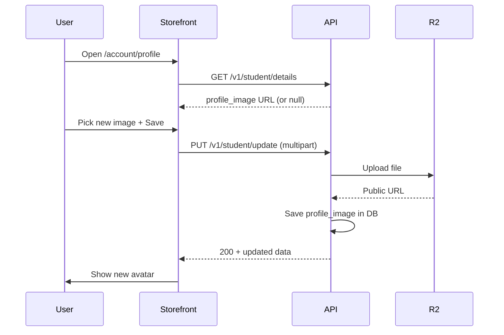

# Student Profile Picture — Storefront Implementation Guide (Final)

এই doc অনুসরণ করলে storefront-এ student profile picture **add + update** কাজ করবে।  
API backend ready; এখানে শুধু storefront integration।

**API base:** `https://<api-host>/v1`  
**Related:** [STUDENT_PROFILE_STOREFRONT_API.md](./STUDENT_PROFILE_STOREFRONT_API.md) · [STUDENT_DEVICE_LOGIN_STOREFRONT_API.md](./STUDENT_DEVICE_LOGIN_STOREFRONT_API.md)

---

## 1. যে endpoint ব্যবহার করবেন (এবং যেটা করবেন না)

| ✅ Storefront (student) | ❌ Admin dashboard — storefront এ ব্যবহার করবেন না |
|------------------------|---------------------------------------------------|
| `GET /v1/student/details` | `GET /v1/private/student/details/{id}` |
| `PUT /v1/student/update` | `PUT /v1/private/student/update/{id}` |
| `POST /v1/student/login` | Admin `Bearer` token |

**404 এড়াতে:**

1. URL অবশ্যই **`/v1/student/update`** — `private` বা `{id}` যোগ করবেন না।
2. Method **`PUT`** — `POST` দিলে 404 পাবেন।
3. `NEXT_PUBLIC_API_URL` শেষে **`/v1`** থাকতে হবে, যেমন `https://api.example.com/v1`  
   - ঠিক: `` `${API_URL}/student/update` `` → `https://api.example.com/v1/student/update`  
   - ভুল: base URL-এ `/v1` নেই → 404  
   - ভুল: base + path দুই জায়গায় `/v1` → `/v1/v1/student/update` → 404
4. Image upload-এ **`multipart/form-data`** — JSON body দিলে image যাবে না (404 নয়, কিন্তু image update হবে না)।
5. Header **`app-key`** + **`Authorization: Bearer <student_jwt>`** — admin token দিলে 401/403, route mismatch হলে 404।

---

## 2. Environment variables (storefront)

```env
# Browser থেকে API call — শেষে /v1 বাধ্যতামূলক
NEXT_PUBLIC_API_URL=https://api.yourdomain.com/v1

# Tenant app key (admin dashboard → tenant settings থেকে)
NEXT_PUBLIC_APP_KEY=your-tenant-app-key
```

Local dev example:

```env
NEXT_PUBLIC_API_URL=http://localhost:5000/v1
NEXT_PUBLIC_APP_KEY=your-local-tenant-app-key
```

---

## 3. Auth — student token কোথা থেকে আসে

Login response-এ `token` আসে; **`profile_image` login response-এ নেই** — profile page load-এ `GET /student/details` করতে হবে।

```http
POST /v1/student/login
app-key: <tenant_app_key>
Content-Type: application/json

{
  "email": "student@example.com",
  "password": "secret",
  "device_id": "stable-browser-id-min-8-chars",
  "device_name": "Chrome on Mac"
}
```

Success:

```json
{
  "token": "<student_jwt>",
  "user": {
    "user_id": "...",
    "name": "Rahim Uddin",
    "email": "rahim@example.com",
    "phone": "01712345678"
  }
}
```

Token `localStorage` (বা আপনার auth store)-এ রাখুন। `device_id` একই browser-এ stable রাখুন — details: [STUDENT_DEVICE_LOGIN_STOREFRONT_API.md](./STUDENT_DEVICE_LOGIN_STOREFRONT_API.md)।

---

## 4. Copy-paste: API client (`lib/studentProfileApi.ts`)

```ts
const API_URL = process.env.NEXT_PUBLIC_API_URL?.replace(/\/$/, "") ?? "";
const APP_KEY = process.env.NEXT_PUBLIC_APP_KEY ?? "";

export type StudentProfile = {
  id: number;
  user_id: string;
  first_name: string;
  last_name: string | null;
  phone: string | null;
  email: string;
  profile_image: string | null;
  status: boolean;
  created_at: string;
  updated_at: string;
};

export class StudentApiError extends Error {
  status: number;
  code?: string;

  constructor(message: string, status: number, code?: string) {
    super(message);
    this.status = status;
    this.code = code;
  }
}

function requireConfig() {
  if (!API_URL) throw new Error("NEXT_PUBLIC_API_URL is not set");
  if (!APP_KEY) throw new Error("NEXT_PUBLIC_APP_KEY is not set");
}

function studentHeaders(token: string): HeadersInit {
  if (!token) {
    throw new StudentApiError("Not logged in", 401);
  }
  return {
    "app-key": APP_KEY,
    Authorization: `Bearer ${token}`,
  };
}

async function parseError(res: Response): Promise<StudentApiError> {
  let body: { error?: string; message?: string; code?: string } = {};
  try {
    body = await res.json();
  } catch {
    // ignore
  }
  const message =
    body.message ?? body.error ?? `Request failed (${res.status})`;
  return new StudentApiError(message, res.status, body.code);
}

/** Load logged-in student profile (includes profile_image). */
export async function fetchStudentProfile(
  token: string
): Promise<StudentProfile> {
  requireConfig();
  const res = await fetch(`${API_URL}/student/details`, {
    method: "GET",
    headers: studentHeaders(token),
    cache: "no-store",
  });

  if (!res.ok) throw await parseError(res);

  const json = (await res.json()) as { data: StudentProfile };
  return json.data;
}

export type UpdateStudentProfileInput = {
  first_name: string;
  last_name?: string;
  phone?: string;
  profile_image?: File | null; // নতুন file; null/undefined = image unchanged
};

/** Update profile + optional new profile picture. */
export async function updateStudentProfile(
  token: string,
  input: UpdateStudentProfileInput
): Promise<StudentProfile> {
  requireConfig();

  const fd = new FormData();
  fd.append("first_name", input.first_name.trim());

  if (input.last_name !== undefined) {
    fd.append("last_name", input.last_name.trim());
  }
  if (input.phone !== undefined && input.phone.trim() !== "") {
    fd.append("phone", input.phone.trim());
  }
  // শুধু নতুন file select করলে append করুন
  if (input.profile_image instanceof File) {
    fd.append("profile_image", input.profile_image);
  }

  const res = await fetch(`${API_URL}/student/update`, {
    method: "PUT",
    headers: studentHeaders(token),
    // ⚠️ Content-Type set করবেন না — browser multipart boundary সহ set করবে
    body: fd,
  });

  if (!res.ok) throw await parseError(res);

  const json = (await res.json()) as {
    message: string;
    data: StudentProfile;
  };
  return json.data;
}
```

### Axios ব্যবহার করলে

```ts
import axios from "axios";

const api = axios.create({
  baseURL: process.env.NEXT_PUBLIC_API_URL, // https://api.example.com/v1
  headers: { "app-key": process.env.NEXT_PUBLIC_APP_KEY },
});

export async function updateStudentProfileAxios(
  token: string,
  input: UpdateStudentProfileInput
) {
  if (!token) throw new Error("Not logged in");

  const fd = new FormData();
  fd.append("first_name", input.first_name);
  if (input.last_name) fd.append("last_name", input.last_name);
  if (input.phone) fd.append("phone", input.phone);
  if (input.profile_image instanceof File) {
    fd.append("profile_image", input.profile_image);
  }

  const res = await api.put("/student/update", fd, {
    headers: {
      Authorization: `Bearer ${token}`,
      // Content-Type intentionally omitted for FormData
    },
  });

  return res.data.data as StudentProfile;
}
```

**কখনো করবেন না:** `Authorization: Bearer ${token}` যখন `token` undefined — এতে `Bearer undefined` যায় এবং 401 আসে।

---

## 5. Copy-paste: Profile form component (React)

```tsx
"use client";

import { useEffect, useRef, useState } from "react";
import {
  fetchStudentProfile,
  updateStudentProfile,
  StudentApiError,
  type StudentProfile,
} from "@/lib/studentProfileApi";

const TOKEN_KEY = "student_token"; // আপনার login flow-এর key-এর সাথে match করুন

const ALLOWED_TYPES = ["image/png", "image/jpeg", "image/jpg"];
const MAX_BYTES = 2 * 1024 * 1024;

function getInitials(p: StudentProfile) {
  const a = p.first_name?.[0] ?? "";
  const b = p.last_name?.[0] ?? "";
  return (a + b).toUpperCase() || "?";
}

export default function StudentProfilePage() {
  const [profile, setProfile] = useState<StudentProfile | null>(null);
  const [firstName, setFirstName] = useState("");
  const [lastName, setLastName] = useState("");
  const [phone, setPhone] = useState("");
  const [newImage, setNewImage] = useState<File | null>(null);
  const [previewUrl, setPreviewUrl] = useState<string | null>(null);
  const [loading, setLoading] = useState(true);
  const [saving, setSaving] = useState(false);
  const [error, setError] = useState<string | null>(null);
  const fileRef = useRef<HTMLInputElement>(null);

  useEffect(() => {
    let cancelled = false;

    (async () => {
      try {
        const token = localStorage.getItem(TOKEN_KEY);
        if (!token) {
          window.location.href = "/login";
          return;
        }
        const data = await fetchStudentProfile(token);
        if (cancelled) return;
        setProfile(data);
        setFirstName(data.first_name);
        setLastName(data.last_name ?? "");
        setPhone(data.phone ?? "");
      } catch (e) {
        if (cancelled) return;
        if (e instanceof StudentApiError && e.status === 401) {
          localStorage.removeItem(TOKEN_KEY);
          window.location.href = "/login";
          return;
        }
        setError(e instanceof Error ? e.message : "Failed to load profile");
      } finally {
        if (!cancelled) setLoading(false);
      }
    })();

    return () => {
      cancelled = true;
    };
  }, []);

  useEffect(() => {
    if (!newImage) {
      setPreviewUrl(null);
      return;
    }
    const url = URL.createObjectURL(newImage);
    setPreviewUrl(url);
    return () => URL.revokeObjectURL(url);
  }, [newImage]);

  function onFileChange(file: File | null) {
    setError(null);
    if (!file) {
      setNewImage(null);
      return;
    }
    if (!ALLOWED_TYPES.includes(file.type)) {
      setError("Only PNG and JPG images are allowed");
      setNewImage(null);
      return;
    }
    if (file.size > MAX_BYTES) {
      setError("Image must be 2MB or smaller");
      setNewImage(null);
      return;
    }
    setNewImage(file);
  }

  async function onSubmit(e: React.FormEvent) {
    e.preventDefault();
    setError(null);
    setSaving(true);

    try {
      const token = localStorage.getItem(TOKEN_KEY);
      if (!token) {
        window.location.href = "/login";
        return;
      }

      const updated = await updateStudentProfile(token, {
        first_name: firstName,
        last_name: lastName,
        phone,
        profile_image: newImage,
      });

      setProfile(updated);
      setNewImage(null);
      if (fileRef.current) fileRef.current.value = "";
    } catch (err) {
      if (err instanceof StudentApiError) {
        if (err.status === 401) {
          localStorage.removeItem(TOKEN_KEY);
          window.location.href = "/login";
          return;
        }
        setError(err.message);
      } else {
        setError("Update failed");
      }
    } finally {
      setSaving(false);
    }
  }

  if (loading) return <p>Loading profile…</p>;
  if (!profile) return <p>{error ?? "Profile not found"}</p>;

  const avatarSrc = previewUrl ?? profile.profile_image;

  return (
    <form onSubmit={onSubmit} className="max-w-md space-y-4">
      <div className="flex items-center gap-4">
        {avatarSrc ? (
          // Next/Image: remotePatterns-এ CDN domain allow করুন
          
        ) : (
          <div className="flex h-20 w-20 items-center justify-center rounded-full bg-gray-200 text-xl font-semibold">
            {getInitials(profile)}
          </div>
        )}
        <div>
          <input
            ref={fileRef}
            type="file"
            accept="image/png,image/jpeg"
            onChange={(e) => onFileChange(e.target.files?.[0] ?? null)}
          />
          <p className="text-xs text-gray-500 mt-1">PNG/JPG, max 2MB</p>
        </div>
      </div>

      <div>
        <label className="block text-sm font-medium">First name *</label>
        <input
          className="mt-1 w-full border rounded px-3 py-2"
          value={firstName}
          onChange={(e) => setFirstName(e.target.value)}
          required
        />
      </div>

      <div>
        <label className="block text-sm font-medium">Last name</label>
        <input
          className="mt-1 w-full border rounded px-3 py-2"
          value={lastName}
          onChange={(e) => setLastName(e.target.value)}
        />
      </div>

      <div>
        <label className="block text-sm font-medium">Phone</label>
        <input
          className="mt-1 w-full border rounded px-3 py-2"
          value={phone}
          onChange={(e) => setPhone(e.target.value)}
        />
      </div>

      <div>
        <label className="block text-sm font-medium">Email</label>
        <input
          className="mt-1 w-full border rounded px-3 py-2 bg-gray-50"
          value={profile.email}
          disabled
        />
      </div>

      {error && <p className="text-sm text-red-600">{error}</p>}

      <button
        type="submit"
        disabled={saving}
        className="rounded bg-black px-4 py-2 text-white disabled:opacity-50"
      >
        {saving ? "Saving…" : "Save profile"}
      </button>
    </form>
  );
}
```

**Update success-এর পর UI refresh:** response-এর `data.profile_image` দিয়ে state update করুন (উপরের code-এ আছে) — আলাদা `GET /details` optional।

---

## 6. Image display (Next.js)

Profile image R2/CDN URL থেকে আসে, যেমন `https://cdn.yourdomain.com/1730_avatar.jpg`।

### Option A — plain `` (সবচেয়ে সহজ)

উপরের component-এ `` — extra config লাগে না।

### Option B — `next/image`

`next.config` এ CDN domain allow করুন:

```ts
// next.config.ts
images: {
  remotePatterns: [
    {
      protocol: "https",
      hostname: "cdn.yourdomain.com",
      pathname: "/**",
    },
  ],
},
```

---

## 7. Server rules (যা API enforce করে)

| Rule | Value |
|------|-------|
| Form field name | `profile_image` (exact) |
| Max size | 2 MB |
| Formats | PNG, JPG/JPEG |
| Storage | Cloudflare R2 (`UploadToBunny` helper) |
| DB column | `students.profile_image` |
| Old image | নতুন upload হলে পুরনো R2 file delete করার চেষ্টা |

Image না পাঠালে পুরনো `profile_image` DB-তে থাকে।

---

## 8. Error troubleshooting (404 সহ)

| Symptom | Cause | Fix |
|---------|-------|-----|
| **404** on update | Wrong path (`/private/...`, missing `/v1`, `POST` not `PUT`) | `PUT ${API_URL}/student/update` where `API_URL` ends with `/v1` |
| **404** | Double `/v1` | Base: `.../v1`, path: `/student/update` only |
| **400** `App key header is missing` | `app-key` header নেই | `NEXT_PUBLIC_APP_KEY` + header |
| **400** `Tenant not found` | Wrong app key | Dashboard tenant-এর সঠিক key |
| **401** `Authorization header is missing` | Token নেই | Login করুন; `Bearer undefined` guard |
| **401** `SESSION_REPLACED` | অন্য device login | Logout + re-login |
| **400** `max image size is 2MB` | File বড় | Client-side 2MB check |
| **400** `only PNG, JPG formats are supported` | WebP/GIF ইত্যাদি | `accept="image/png,image/jpeg"` |
| **400** `first_name` validation | `first_name` খালি | Form-এ required রাখুন |
| Image upload হয় কিন্তু UI পুরনো | State update হয়নি | `setProfile(res.data)` after PUT |
| Image URL broken (not 404 API) | R2 public domain misconfigured | API env `R2_PUBLIC_BASE_URL` + CDN routing |

API-level 404 on profile update শুধু **`Student not found`** (খুব rare — token valid কিন্তু DB record নেই)।

---

## 9. End-to-end flow



---

## 10. cURL smoke test (deploy verify)

```bash
API="https://api.yourdomain.com/v1"
APP_KEY="your-tenant-app-key"

# 1) Login
TOKEN=$(curl -s -X POST "$API/student/login" \
  -H "app-key: $APP_KEY" \
  -H "Content-Type: application/json" \
  -d '{"email":"student@example.com","password":"secret","device_id":"storefront-test-001"}' \
  | jq -r .token)

echo "token: ${TOKEN:0:20}..."

# 2) Get profile
curl -s "$API/student/details" \
  -H "app-key: $APP_KEY" \
  -H "Authorization: Bearer $TOKEN" | jq '.data.profile_image'

# 3) Update with image
curl -s -X PUT "$API/student/update" \
  -H "app-key: $APP_KEY" \
  -H "Authorization: Bearer $TOKEN" \
  -F "first_name=Rahim" \
  -F "last_name=Uddin" \
  -F "profile_image=@./avatar.jpg" | jq '.data.profile_image'
```

Expected: step 3 → নতুন `https://cdn.../timestamp_avatar.jpg` URL।

---

## 11. Implementation checklist

- [ ] `NEXT_PUBLIC_API_URL` = `https://<api>/v1` (trailing slash optional, `/v1` mandatory)
- [ ] `NEXT_PUBLIC_APP_KEY` = tenant app key
- [ ] Student login-এ `token` save (`localStorage` বা auth store)
- [ ] Profile page: `GET /student/details` on load
- [ ] Update form: `PUT /student/update` with `FormData`
- [ ] Form field: `profile_image` (file), `first_name` (required)
- [ ] `Content-Type` manually set করা হয়নি (FormData)
- [ ] Token guard — missing token হলে request skip + redirect login
- [ ] 401 / `SESSION_REPLACED` → clear session + login
- [ ] Success response `data` দিয়ে UI update
- [ ] Placeholder avatar যখন `profile_image` null
- [ ] (Optional) Client validation: 2MB, PNG/JPG

এই checklist complete করলে profile picture add/update storefront-এ কাজ করবে।
