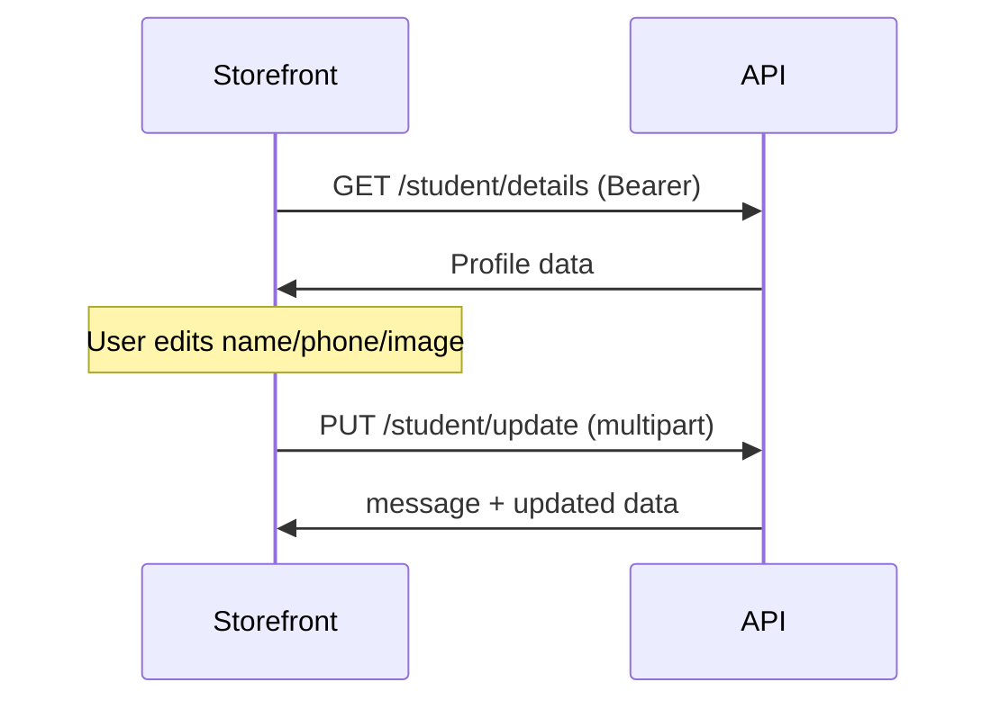

# Student Profile (Details + Image) — Storefront API

**API base:** `https://<api-host>/v1`

Logged-in student নিজের profile দেখতে ও edit করতে পারবে (name, phone, profile image)।  
**Email change করা যায় না** — signup/login email fixed থাকে।

সব request এ **`app-key: <tenant_app_key>`** header লাগবে।  
Protected route এ **`Authorization: Bearer <student_jwt>`** (login থেকে পাওয়া token)।

---

## Status

| Layer | Status |
|-------|--------|
| API `GET /student/details` | ✅ Ready |
| API `PUT /student/update` | ✅ Ready |
| Storefront integration | আপনার storefront এ implement করতে হবে |

---

## Quick reference

| Action | Method | Path | Auth |
|--------|--------|------|------|
| Profile দেখা | `GET` | `/student/details` | `app-key` + `Bearer` |
| Profile + image update | `PUT` | `/student/update` | `app-key` + `Bearer` |
| Login (token নেওয়ার জন্য) | `POST` | `/student/login` | `app-key` |

**Admin dashboard (reference only — storefront এ ব্যবহার করবেন না):**

| Action | Method | Path | Auth |
|--------|--------|------|------|
| Student details (by ID) | `GET` | `/private/student/details/{id}` | Admin `Bearer` |
| Student update (by ID) | `PUT` | `/private/student/update/{id}` | Admin `Bearer` |

---

## Auth headers

```http
app-key: <tenant_app_key>
Authorization: Bearer <student_jwt>
```

Token `POST /student/login` response এর `token` field। Single-device session — details: [STUDENT_DEVICE_LOGIN_STOREFRONT_API.md](./STUDENT_DEVICE_LOGIN_STOREFRONT_API.md)।

---

## 1. Get profile — `GET /student/details`

### Request

```http
GET /v1/student/details
app-key: <tenant_app_key>
Authorization: Bearer <student_jwt>
```

### Success `200`

```json
{
  "data": {
    "id": 42,
    "user_id": "ckx...",
    "first_name": "Rahim",
    "last_name": "Uddin",
    "phone": "01712345678",
    "email": "rahim@example.com",
    "profile_image": "https://cdn.example.com/students/abc.jpg",
    "status": true,
    "created_at": "2025-01-10T08:00:00Z",
    "updated_at": "2025-06-01T12:00:00Z",
    "enrollments": [
      {
        "id": 10,
        "student_id": 42,
        "course_id": 5
      }
    ]
  }
}
```

| Field | Notes |
|-------|-------|
| `profile_image` | `null` হতে পারে — placeholder avatar দেখান |
| `email` | Read-only; update API তে পাঠাবেন না |
| `enrollments` | Enrolled course IDs; course detail আলাদা API থেকে |

### Errors

| Status | Meaning |
|--------|---------|
| `401` | Token missing/invalid, বা অন্য device এ login হয়েছে (`SESSION_REPLACED`) |
| `403` | Account inactive |

---

## 2. Update profile + image — `PUT /student/update`

**`multipart/form-data`** ব্যবহার করুন (JSON নয়) — image upload এর জন্য।

### Request fields

| Field | Required | Type | Notes |
|-------|----------|------|-------|
| `first_name` | ✅ | string | |
| `last_name` | ❌ | string | খালি রাখলে clear হতে পারে |
| `phone` | ❌ | string | Unique per tenant; duplicate হলে DB error |
| `profile_image` | ❌ | file | নতুন image upload; না দিলে পুরনো image থাকবে |

### Image rules

| Rule | Value |
|------|-------|
| Max size | **2 MB** |
| Formats | **PNG, JPG/JPEG** |
| Field name | `profile_image` |

নতুন image upload করলে server পুরনো Bunny CDN file delete করার চেষ্টা করে।

### Example — শুধু text update (image unchanged)

```http
PUT /v1/student/update
app-key: <tenant_app_key>
Authorization: Bearer <student_jwt>
Content-Type: multipart/form-data

first_name=Rahim
last_name=Uddin
phone=01712345678
```

### Example — text + নতুন profile image

```http
PUT /v1/student/update
app-key: <tenant_app_key>
Authorization: Bearer <student_jwt>
Content-Type: multipart/form-data

first_name=Rahim
last_name=Uddin
phone=01712345678
profile_image=<binary file>
```

### Success `200`

```json
{
  "message": "Profile updated successfully",
  "data": {
    "id": 42,
    "user_id": "ckx...",
    "first_name": "Rahim",
    "last_name": "Uddin",
    "phone": "01712345678",
    "email": "rahim@example.com",
    "profile_image": "https://cdn.example.com/students/new.jpg",
    "status": true,
    "created_at": "2025-01-10T08:00:00Z",
    "updated_at": "2025-07-05T10:00:00Z",
    "enrollments": []
  }
}
```

Response এর `data` দিয়ে UI তৎক্ষণাৎ refresh করতে পারেন — আবার `GET /details` call optional।

### Errors

| Status | Example `error` | Cause |
|--------|-----------------|-------|
| `400` | `max image size is 2MB` | Image too large |
| `400` | `only PNG, JPG formats are supported` | Wrong file type |
| `400` | validation message | `first_name` missing |
| `401` | `Invalid or expired token` | Re-login করুন |
| `404` | `Student not found` | Rare — token valid কিন্তু record নেই |

---

## Storefront implementation

### Suggested pages

| Page | API |
|------|-----|
| `/account` or `/account/profile` | `GET /student/details` on load |
| Edit profile form | `PUT /student/update` on submit |

### Fetch example (profile load)

```ts
const token = localStorage.getItem("student_token"); // আপনার storage key
if (!token) {
  redirectToLogin();
  return;
}

const res = await fetch(`${API_URL}/student/details`, {
  headers: {
    "app-key": APP_KEY,
    Authorization: `Bearer ${token}`,
  },
});

if (res.status === 401) {
  // SESSION_REPLACED বা expired — logout + login page
  clearSession();
  redirectToLogin();
  return;
}

const { data } = await res.json();
```

### FormData example (update)

```ts
const fd = new FormData();
fd.append("first_name", firstName);
if (lastName) fd.append("last_name", lastName);
if (phone) fd.append("phone", phone);
if (newImageFile) fd.append("profile_image", newImageFile);
// image change না করলে profile_image field append করবেন না

const res = await fetch(`${API_URL}/student/update`, {
  method: "PUT",
  headers: {
    "app-key": APP_KEY,
    Authorization: `Bearer ${token}`,
    // Content-Type set করবেন না — browser boundary সহ set করবে
  },
  body: fd,
});

const json = await res.json();
if (!res.ok) throw new Error(json.error ?? "Update failed");

// json.data = updated profile
setProfile(json.data);
```

### UI tips

1. **Email** — form এ দেখান কিন্তু disabled রাখুন; update payload এ পাঠাবেন না।
2. **Image preview** — `profile_image` URL থেকে ``; upload এ `URL.createObjectURL(file)`।
3. **Client validation** (optional, UX): max 2MB, PNG/JPG only — server same rules enforce করে।
4. **Bearer guard** — token না থাকলে request skip করুন; `Authorization: Bearer undefined` পাঠাবেন না।
5. **401 handling** — centralized interceptor এ `SESSION_REPLACED` message user কে দেখান।

---

## Flow diagram



---

## Related docs

| Doc | Topic |
|-----|-------|
| [STUDENT_DEVICE_LOGIN_STOREFRONT_API.md](./STUDENT_DEVICE_LOGIN_STOREFRONT_API.md) | Login, `device_id`, session |
| [STUDENT_PASSWORD_RESET_STOREFRONT_API.md](./STUDENT_PASSWORD_RESET_STOREFRONT_API.md) | Password change (profile update নয়) |

---

## cURL smoke test

```bash
API="https://api.example.com/v1"
APP_KEY="your-tenant-app-key"

# Login
TOKEN=$(curl -s -X POST "$API/student/login" \
  -H "app-key: $APP_KEY" \
  -H "Content-Type: application/json" \
  -d '{"email":"student@example.com","password":"secret","device_id":"test-device-001"}' \
  | jq -r .token)

# Get profile
curl -s "$API/student/details" \
  -H "app-key: $APP_KEY" \
  -H "Authorization: Bearer $TOKEN" | jq

# Update (text only)
curl -s -X PUT "$API/student/update" \
  -H "app-key: $APP_KEY" \
  -H "Authorization: Bearer $TOKEN" \
  -F "first_name=Rahim" \
  -F "last_name=Uddin" \
  -F "phone=01712345678" | jq

# Update with image
curl -s -X PUT "$API/student/update" \
  -H "app-key: $APP_KEY" \
  -H "Authorization: Bearer $TOKEN" \
  -F "first_name=Rahim" \
  -F "profile_image=@./avatar.jpg" | jq
```
